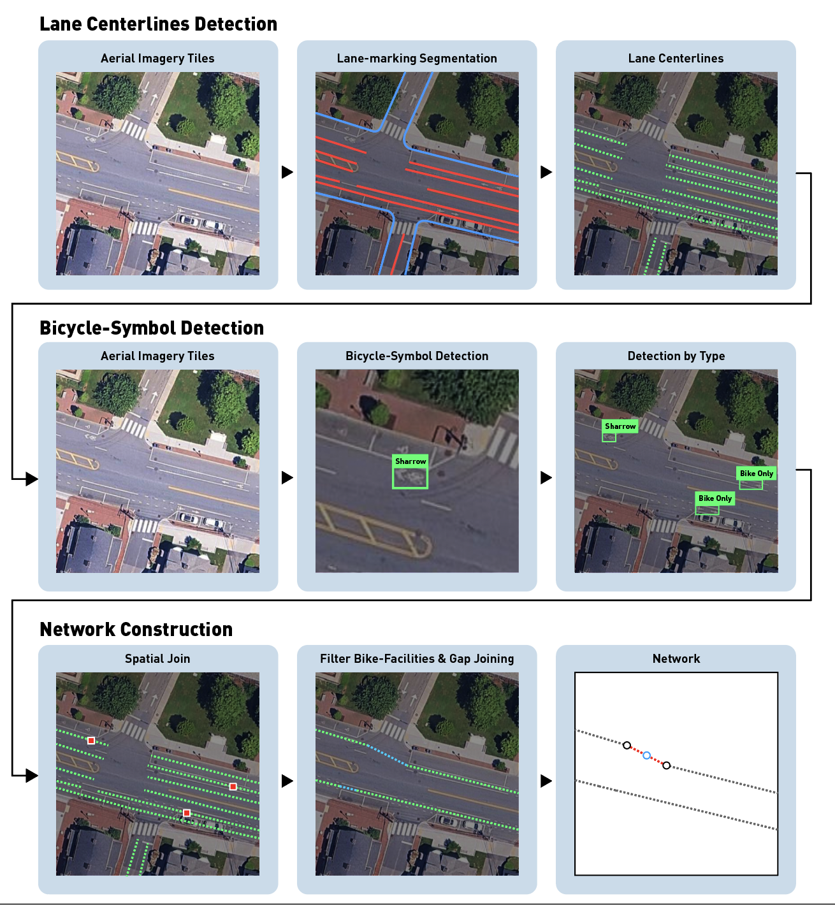

# BikeTrace

<p align="center">
  
</p>

**BikeTrace** (`bikelane-extract`) maps on-street bike facilities — dedicated
bike lanes and sharrows (shared-lane markings) — from high-resolution aerial
imagery. A U-Net segments the painted lane markings on every tile, the
markings are turned into lane centerlines, a YOLO detector finds the bike
pavement symbols, and the two are joined: a centerline supported by symbols is
a bike lane, typed `BikeOnly` or `Sharrow`. Gaps between pieces are closed and
intersections connected through OSM junction nodes, so the result is a
routable edge/node network of bike facilities with, for every edge, the number
of symbols supporting it and how much of its length was observed versus
inferred. Developed on MassDOT 15 cm imagery of Lexington and Boston, MA.

<br>

**Highlights**

* **Lane-level, not street-level**: the output follows the painted lane, between the markings, not the road centerline.
* **Facility type from evidence**: every edge carries `n_signs`, the per-class symbol counts and the detector confidence behind its type.
* **Observed vs. inferred**: gap filling and intersection links are recorded per edge (`obs_ratio`), so inference can be filtered or field-checked.
* **Independent of OSM bike tags**: OSM is used only for junction nodes, so its bike tags remain an independent source for validation.

<br>

## Updates

* **[September 2026]** Version 0: segmentation model trained on OpenSatMap level-20 (0.15 m/px); bike-symbol detector trained on labeled MassDOT tiles; parameters fixed on Lexington, MA.

<br>
<br>

## Getting Started

1. [Requirements](#requirements)
2. [Installation](#installation)
3. [Run Our Example](#run-our-example)
4. [Get the imagery](#get-the-imagery)
5. [Run Your Project](#run-your-project)

### Requirements

**Hardware**

* 1 CUDA GPU (or Apple MPS) for stage 1 (segmentation) and stage 3 (symbol detection); both run on CPU in a few hours per town.
* Stage 2 (centerlines) is CPU only: ~3 GB RAM per worker at the default chunk size (`--chunk 4` for ~1.5 GB).
* ~50 GB free disk per town (tiles + predictions), more for the imagery download itself.

**Software**

* Linux or macOS, Python ≥ 3.10 (Windows: WSL).
* PyTorch ≥ 2.0 with a build matching your CUDA driver.
* Key dependencies (installed by `requirements.txt`): `segmentation-models-pytorch`, `ultralytics`, `numpy`, `scipy`, `shapely`, `networkx`, `scikit-image`, `opencv`, `osmnx`.

**Input imagery**

* 1024 px tiles at 0.15 m/px with 25 % overlap, named `tile_px<X>_py<Y>.jpg`, plus a `Tile_Mappings.csv` — exactly what [`../download_MassGIS2025AerialImagery/`](../download_MassGIS2025AerialImagery/) produces from the MassGIS 2025 orthophotos. Other imagery works if it is brought into the same layout (see `run/README.md`).

<br>

### Installation

**1. Clone the repository** and enter the bicyclist-network folder:

```bash
git clone https://github.com/remap-research-group/routable-mobility-networks.git
cd routable-mobility-networks/bicyclist_network
```

**2. Create the environment.** Install PyTorch first — together with
torchvision and from the index that matches your CUDA driver — then the
package with its dependencies (this also registers the `bikelane` command):

```bash
conda create --name bikenet python=3.10 -y
conda activate bikenet
pip install torch torchvision --index-url https://download.pytorch.org/whl/cu128   # cu126 / cpu: see pytorch.org
pip install -e ".[all]"          # or: pip install -r requirements.txt && pip install -e .
bikelane --help
```

**3. Download the pretrained weights.** The two checkpoints (segmentation
U-Net ~94 MB, YOLO detector ~45 MB) are too large for git and are attached to
the GitHub Release
[`bikenet-v0.1`](https://github.com/remap-research-group/routable-mobility-networks/releases/tag/bikenet-v0.1).
`download.py` (standard library only) fetches them, verifies the checksums and
puts them where the code expects them:

```bash
python download.py               # → run/src/seg_unet_r34.pt, run/src/yolo26m_bikesign.pt
python download.py --tiles BOSTON    # optionally + the example imagery (see Run Our Example)
```

Manual alternative: download both `.pt` files from the release page into `run/src/`.

<br>

### Run Our Example

The two reference towns, Boston (dense downtown) and Lexington (suburban),
are the examples: their `Tile_Mappings.csv` / `imagery_info.json` and our
results are in `example/`, the tiles themselves come from the GitHub Release
(they are several GB). From `bicyclist_network/`:

```bash
python download.py --tiles BOSTON            # ~4 GB → example/input/BOSTON/tiles/  (LEXINGTON: ~14 GB)
bikelane config  -c example/boston.yaml      # paths, CRS, weights — everything found?
bikelane predict -c example/boston.yaml      # then the remaining stages, see example/README.md
# … or all stages at once (~1 h on one GPU):
cp example/boston.yaml bikelane.yaml && bash run/run_all.sh
```

Your run goes to `example/output/bikelanes/BOSTON/`, our results are in
`example/output/provided/BOSTON/main/`, so the two can be compared file for
file. See [example/README.md](example/README.md).

<p align="center"></p>

<br>

### Get the imagery

The analysis does not download imagery itself. Run the sibling tool for your
area first — it writes the tiles the stages read, under
`download_MassGIS2025AerialImagery/output/<REGION>/`:

```bash
cd ../download_MassGIS2025AerialImagery
pip install -r requirements.txt                      # + gdal-bin on PATH
python fetch.py --city Lexington --state MA          # (long) orthophoto zips → mosaic
python tile.py  --city Lexington --state MA          # mosaic → tiles/ + Tile_Mappings.csv
cd ../bicyclist_network
```

Give BikeTrace the **same area** (below) and it finds the tiles by the
region tag (`Lexington` → `LEXINGTON`). Tiles that live elsewhere: set
`imagery_root:` in `bikelane.yaml`, or point `paths.tiles_dir` /
`paths.tile_mappings_csv` straight at them.

<br>

### Run Your Project

**1. Name the area.** Copy the template and write the town (as in the Census
county subdivisions) or a boundary polygon — the same one you gave the download
tool:

```bash
cp bikelane.example.yaml bikelane.yaml
```
```yaml
city: Lexington
state: MA
# data_root: ./data                                        # where every stage writes
# imagery_root: ../download_MassGIS2025AerialImagery/output  # where the tiles are (default)
```

```bash
bikelane config          # region tag, CRS, every input/output path and whether it exists
```

**2. Run the stages**, from `bicyclist_network/`. Each one reads the previous
one's files and prints what to look at before the next; `--check` validates the
inputs of a stage without running it. Long stages: run inside `tmux`.

```bash
bikelane predict                     # 1  tiles → lane-marking class masks              (GPU)
bikelane centerlines all             # 2  masks → lane centerlines                      (CPU, long)
bikelane signs detect                # 3  tiles → bike pavement symbols (raw)           (GPU)
bikelane signs filter --sweep        #    choose the acceptance threshold, then:
bikelane signs filter
bikelane join match                  # 4  symbols × centerlines → bike lanes with a type
bikelane join clean
bikelane osm                         #    OSM junction nodes for the tile extent
bikelane gaps scan                   # 5  gap candidates — look at them in QGIS, then:
bikelane gaps join
bikelane gaps intersections
bikelane gaps network                #    → edges + nodes
```

Or everything unattended, with the defaults and no checks in between:

```bash
bash run/run_all.sh                  # log: <data_root>/logs/run_all_<REGION>.log
```

**3. Outputs** (`<data_root>/`, GeoJSON in the imagery CRS, metres):

```
bikelanes/<REGION>/main/              THE THREE PRODUCTS
├── <region>_bike_facilities.geojson  typed facility lines: type (BikeOnly | Sharrow), n_signs, obs_ratio …
├── <region>_network_edges.geojson    facility lines + intersection connectors, shared node ids;
│                                     type = BikeOnly | Sharrow | Intersection
└── <region>_network_nodes.geojson    endpoints / intersections
bikelanes/<REGION>/byproduct/         review layers: matched / unmatched symbols, gap candidates, links
centerlines/<REGION>/                 all lane centerlines (not only bike lanes)
signs/<REGION>/                       raw / accepted / dropped symbol detections
predictions/<REGION>/                 per-tile class masks
logs/<REGION>/                        run logs + a snapshot of the configuration used
```

See [run/README.md](run/README.md) for every stage, its parameters, the
diagnostics to read between stages, the output formats and troubleshooting.

**Training your own models.** The released weights were trained on OpenSatMap
(segmentation) and on Massachusetts tiles (symbol detector). If your imagery or
region differs enough that predictions are weak, [`train/`](train/README.md)
holds both training pipelines; each ends with an export step that drops the
new weights into `run/src/`, so the run stages pick them up without any other
change.

<br>
<br>

## Repository Structure

```
bicyclist_network/
├── download.py              # fetch the released weights → run/src/
├── bikelane.example.yaml    # project-file template: the area, data_root, imagery_root, overrides
├── requirements.txt / pyproject.toml
├── example/                 # the two reference towns: tile index + our results (tiles from the release)
├── misc/                    # figures
├── run/                     # everything needed to run the tool
│   ├── bikelane_extract/    #   the package behind the `bikelane` command (stages 1–5, osm, config)
│   ├── src/                 #   model weights (+ SHA256SUMS)
│   └── run_all.sh           #   all stages end to end
└── train/                   # how the models were trained
    ├── seg/                 #   OpenSatMap → U-Net lane-marking segmentation → run/src/
    └── yolo/                #   labeled tiles → YOLO bike-symbol detector → run/src/
```

Imagery download and tiling is the sibling folder
[`../download_MassGIS2025AerialImagery/`](../download_MassGIS2025AerialImagery/).

License: MIT. The segmentation training data (OpenSatMap) is CC BY-NC-SA 4.0 —
check that the licence fits your use before retraining with it.
