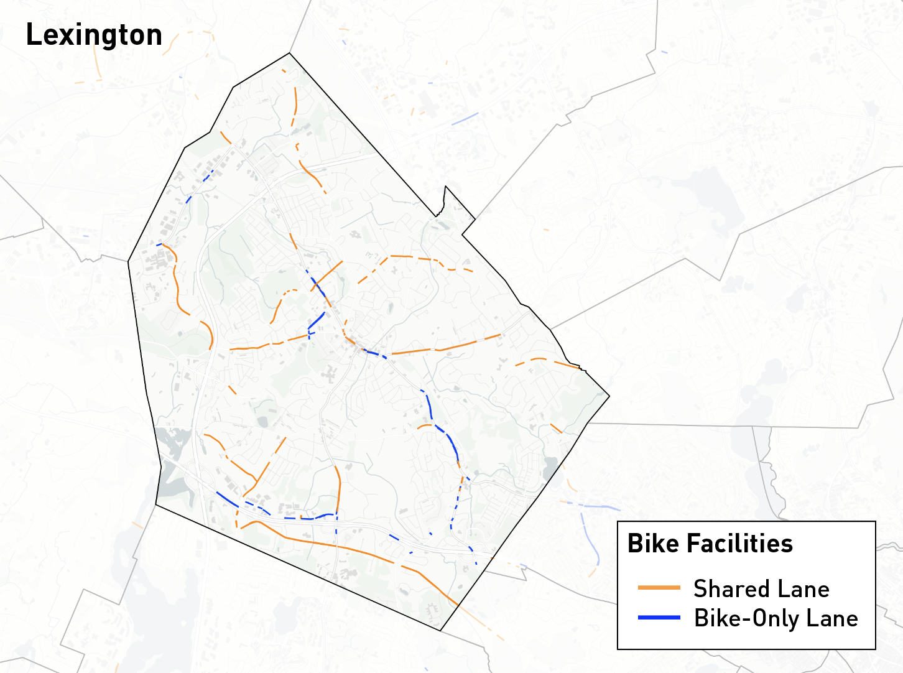
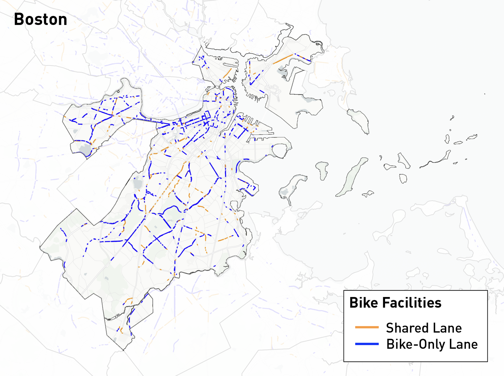

# example/ — run the pipeline on bundled imagery

Two ready-to-run examples, one per reference town, so you can verify your
environment, the weights and the expected outputs before running your own
area:

| Example | Input | What it shows |
|---|---|---|
| `LEXINGTON` | a block of 1024 px MassGIS 2025 tiles, 0.15 m/px, suburban town | the plain five-stage run; shared lanes (sharrows) dominate |
| `BOSTON` | a block of 1024 px MassGIS 2025 tiles, 0.15 m/px, dense downtown | the same run in a dense setting; mostly dedicated bike lanes; more intersection connectors |

All commands below assume the environment from the root README is active
(`pip install -e ".[all]"`, `python download.py`) and you are in
`bicyclist_network/`. Our results are shipped in `output/provided/<REGION>/`;
the commands write your own run to `output/` (git-ignored), so the two can be
compared side by side.

```
example/
├── lexington.yaml, boston.yaml   # project files: imagery_root = input/, data_root = output/
├── make_input.py                 # cuts an example block out of a full imagery run
├── input/<REGION>/               # tiles/, Tile_Mappings.csv, imagery_info.json — a complete imagery_root
└── output/
    ├── provided/<REGION>/        # our results: main/ + byproduct/ (committed)
    └── bikelanes/<REGION>/…      # your run (git-ignored), same layout as any data_root
```

<br>

## The inputs

Each `input/<REGION>/` is exactly what `download_MassGIS2025AerialImagery`
writes for a region, restricted to a block of tiles: `tiles/tile_px<X>_py<Y>.jpg`
(1024 px, 0.15 m/px, 25 % overlap), a `Tile_Mappings.csv` with only those
tiles, and the `imagery_info.json` with the CRS. They come from the same
MassGIS 2025 orthophotos the reference runs used
(https://www.mass.gov/info-details/massgis-data-2025-aerial-imagery).

<!-- PLACEHOLDER (no figure in the memo): a 2-panel image of the two input blocks, e.g. misc/example_input.png -->

<br>

## Run it

```bash
bikelane config      -c example/lexington.yaml     # region, CRS, every path — tiles found?
bikelane predict     -c example/lexington.yaml     # 1  masks                     (GPU, ~1 min)
bikelane centerlines -c example/lexington.yaml all # 2  lane centerlines          (CPU, minutes)
bikelane signs       -c example/lexington.yaml detect
bikelane signs       -c example/lexington.yaml filter
bikelane join        -c example/lexington.yaml match
bikelane join        -c example/lexington.yaml clean
bikelane osm         -c example/lexington.yaml     #    OSM junction nodes (network access)
bikelane gaps        -c example/lexington.yaml scan
bikelane gaps        -c example/lexington.yaml join
bikelane gaps        -c example/lexington.yaml intersections
bikelane gaps        -c example/lexington.yaml network
```

Or copy the project file to the root and use the runner:

```bash
cp example/lexington.yaml bikelane.yaml && bash run/run_all.sh
```

Repeat with `boston.yaml`. Every stage prints what it read, what it wrote and
the counts to look at (lines, km, components); `--check` before a stage lists
its inputs. On a small block the sweeps (`signs filter --sweep`,
`join match --sweep`, `gaps scan --sweep`) have too few samples to be
meaningful — the defaults from the full-town runs are used as they are.

<br>

## What you get

```
output/bikelanes/LEXINGTON/
├── main/                                      the three deliverables
│   ├── lexington_bike_facilities.geojson      typed facility lines: type (BikeOnly | Sharrow), n_signs, obs_ratio …
│   ├── lexington_network_edges.geojson        facility lines + intersection connectors with shared node ids
│   └── lexington_network_nodes.geojson        endpoints / intersections
└── byproduct/                                 review layers
    ├── lexington_bikelanes_match.geojson      every centerline within 2 m of an accepted symbol
    ├── lexington_unmatched_signs.geojson      accepted symbols with no centerline (nearest_m)
    ├── lexington_bikelanes_clean.geojson
    ├── lexington_gap_join.geojson             straight-gap candidates (2-vertex lines)
    ├── lexington_gap_crossing.geojson         intersection-crossing candidates
    ├── lexington_bikelanes_joined.geojson
    └── lexington_intersection_links.geojson   endpoint → node links before the network merge
output/predictions/LEXINGTON/*_pred.png        stage 1 class masks (0 bg, 1 lane, 2 curb, 3 virtual)
output/centerlines/LEXINGTON/                  all lane centerlines, not only bike lanes
output/signs/LEXINGTON/                        raw / accepted / dropped symbol detections (CSV + GeoJSON)
output/osm/LEXINGTON/                          OSM drive nodes with is_junction
output/logs/LEXINGTON/                         run logs, config snapshots, crs.txt
```

In `network_edges`, one field tells the three kinds of edge apart: `type` is
`BikeOnly` or `Sharrow` for a facility edge and `Intersection` for a connector
(`edge_type` says `facility` / `connector` as well). GeoJSONs are in the
imagery CRS (metres); see `run/README.md` § 5 for every property.

The extracted facilities over the whole towns, from which the example blocks
were cut (shared lanes orange, bike-only lanes blue):

<p align="center"></p>
<p align="center"></p>

<!-- PLACEHOLDER (no figure in the memo): the example blocks themselves — main/ layers over the input tiles, one panel per town -->

<br>

## Making the example inputs (maintainers)

The blocks are cut from a full region with `make_input.py`; pick a spot that
has facilities of both types and at least one intersection, and keep it small
(6 × 6 tiles = one centerline chunk ≈ 10 MB; 12 × 12 at most):

```bash
python example/make_input.py --src ../download_MassGIS2025AerialImagery/output/LEXINGTON --tile tile_px<X>_py<Y>.jpg --n 6
python example/make_input.py --src ../download_MassGIS2025AerialImagery/output/BOSTON    --bbox <x0> <y0> <x1> <y1>
```

Then run all stages with `example/<town>.yaml`, and copy
`example/output/bikelanes/<REGION>/{main,byproduct}` to
`example/output/provided/<REGION>/` (the only `.geojson` files the repository
does not ignore). The full-town `main/` layers are too large for an example
but small enough for a GitHub Release asset — attach them there and link them
from this README.
