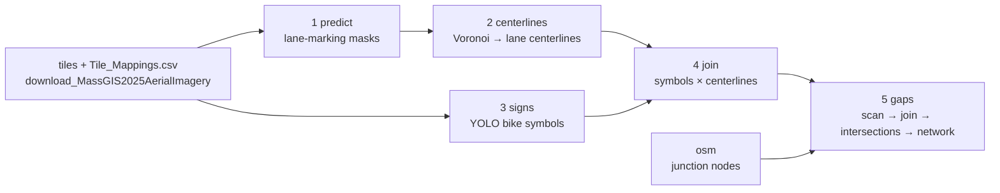

# run/ — apply the tool to your imagery

Five stages turn 1024 px orthophoto tiles into a bike-facility network. Every
stage is a `bikelane` subcommand that reads the project file `bikelane.yaml`
in the current directory, reads the previous stage's files and writes its own.
Nothing runs end to end on purpose: between most stages there is a number to
look at, a sweep to run, or a file to open in QGIS before you continue
(`run_all.sh` skips all of that).



```
run/
├── bikelane_extract/         # the package (installed with `pip install -e .` from bicyclist_network/)
│   ├── cli.py                #   entry point: `bikelane <stage>`; reads ./bikelane.yaml
│   ├── config.py             #   default.yaml + bikelane.yaml + --set; path resolution; run snapshots
│   ├── default.yaml          #   ALL parameters (not edited)
│   ├── io.py                 #   GeoJSON read/write with backup, tile ↔ map mapping, sign CSV
│   ├── geom.py               #   polyline geometry shared by stages 2, 4, 5
│   ├── facility.py           #   facility-type vocabulary (BikeOnly / Sharrow / OnlyBikeBus)
│   ├── model/                #   seg model definition + device selection (shared with train/seg)
│   ├── s01_predict/          #   predict.py
│   ├── s02_centerline/       #   voronoi.py (mask → centerline)  skeleton.py (pixels → polylines)
│   │                         #   extract.py (chunked run)  graph.py  clean.py  run.py
│   ├── s03_signs/            #   detect.py, filter.py, run.py
│   ├── s04_join/             #   spatial_join.py, clean.py, run.py
│   ├── s05_gaps/             #   scan.py, join.py, intersections.py, network.py, common.py, run.py
│   └── osm.py                #   OSM drive network + junction nodes
├── src/                      # the trained models — python download.py puts them here
│   ├── seg_unet_r34.pt       #   U-Net (ResNet34), 4 classes: background / lane line / curb / virtual line
│   ├── yolo26m_bikesign.pt   #   YOLO, 3 classes: BikeOnly / Sharrow / OnlyBikeBus
│   └── SHA256SUMS
└── run_all.sh                # every stage in order, no checks in between
```

Dependencies run in one direction only: a stage imports from `config`, `io`,
`geom`, `facility`, `model` and from lower-numbered stages, never from a
higher-numbered one.

<br>

## Contents

1. [The stages at a glance](#1-the-stages-at-a-glance)
2. [Configuration](#2-configuration)
3. [Where files go](#3-where-files-go)
4. [Running the pipeline, stage by stage](#4-running-the-pipeline-stage-by-stage)
5. [Output files](#5-output-files)
6. [Running a new area, and when to re-check parameters](#6-running-a-new-area-and-when-to-re-check-parameters)
7. [Troubleshooting](#7-troubleshooting)

<br>

## 1. The stages at a glance

| # | Command | What it does | Time | Needs |
|---|---------|--------------|------|-------|
| 1 | `bikelane predict` | Run the segmentation model on every tile → class masks | 10–30 min | GPU, `run/src/seg_unet_r34.pt` |
| 2 | `bikelane centerlines` | Class masks → lane centerlines (Voronoi boundary between markings) → cleaned polylines | 1–3 h | CPU, RAM |
| 3 | `bikelane signs` | Detect bike pavement symbols with YOLO; filter by confidence | 30 min + | GPU, `run/src/yolo26m_bikesign.pt` |
| 4 | `bikelane join` | Attach symbols to centerlines → bike-lane lines with a type | seconds | — |
| 5 | `bikelane gaps` | Close short gaps between bike-lane pieces; connect across intersections via nodes; build the edge/node network | seconds | `osm` output |
| – | `bikelane osm` | Fetch the OSM road network and junction nodes for the region (used by stage 5) | minutes | network |
| – | `bikelane config` | Print the region, CRS, parameters and every path in effect | — | — |

The normal path for a new area, after the imagery tool has run for it:

```
predict → centerlines → signs → join → osm → gaps
```

Every command has the same shape:

```
bikelane <stage> [step] [options]
bikelane <stage> --check [step]      # validate inputs for this stage, run nothing
```

`--check` prints every input file the stage needs and whether it exists. Use
it before every stage. Optional dependencies are imported lazily, so a stage
whose extra is not installed says which one (`pip install -e ".[signs]"`).

<br>

## 2. Configuration

Two files, and you edit only the first:

**`bikelane.yaml`** — the project file, in `bicyclist_network/`. Copy the
template once, write the area, and every command reads it from the current
directory (or `-c path/to/file`). It describes *your* run on *your* machine.

```bash
cp bikelane.example.yaml bikelane.yaml
```
```yaml
city: Boston                 # a town — as named in the Census county subdivisions
state: MA
# boundary: /path/to/area.geojson   # …or any polygon file
# name: boston_mpo                  #    with the region name to use for it
# data_root: ./data                 # where every stage writes (default ./data)
# imagery_root: ../download_MassGIS2025AerialImagery/output   # where the tiles are read from (default)
```

The area becomes the **region tag** in every path: `Fall River` →
`FALL_RIVER`, `name: boston_mpo` → `BOSTON_MPO`. The imagery tool derives the
same tag from the same `--city` / `--name`, which is how the two meet: the
stages read `<imagery_root>/<REGION>/tiles/` and
`<imagery_root>/<REGION>/Tile_Mappings.csv`.

The **CRS** is taken from `<imagery_root>/<REGION>/imagery_info.json`, which
the imagery tool writes with the mosaic CRS the tile coordinates are in. If
that file is absent (tiles made some other way), the area's UTM zone is used
(needs `pip install -e ".[area]"`), or set `crs:` explicitly. The result is
remembered in `<data_root>/logs/<REGION>/crs.txt`.

Relative `data_root` / `imagery_root` are relative to the project file, so the
layout is the same whichever directory you run from. Command-line overrides
for one run: `--city`, `--state`, `--data-root`, `--imagery-root`, `--crs`.

**`run/bikelane_extract/default.yaml`** — every parameter, shipped inside the
package with the values fixed during development (Lexington, MA, 2026). Not
edited. To see what is in effect for the current project:

```bash
bikelane config
```

### Changing something

Any key from `default.yaml` can be overridden in `bikelane.yaml`, and so can
any input or output location under `paths:` — which is how you use data that
already exists somewhere else instead of re-creating it:

```yaml
city: Boston
state: MA
paths:
  tiles_dir:         /existing/Aerial_Images/BOSTON/BOSTON_Tiled
  tile_mappings_csv: /existing/Aerial_Images/BOSTON/Tile_Mappings.csv
  weights_dir:       /shared/weights            # default run/src/
join:
  radius_m: 1.5
centerlines:
  chunk_tiles: 4           # laptop
```

For a one-off, override on the command line without touching the file:

```bash
bikelane join match --set join.radius_m=1.5
bikelane predict --city "Fall River" --state MA      # another town, same project
bikelane predict -c /path/to/other/bikelane.yaml     # another project file
```

Every stage run writes the configuration it actually used to
`<data_root>/logs/<REGION>/config_<stage>_<timestamp>.yaml`, so a result can
always be traced back to its parameters.

### Parameter sections

| YAML key | Used by | What it controls |
|----------|---------|------------------|
| `resolution_m`, `tile_px` | all | 0.15 m/px, 1024 px — must match the tiles (`imagery_info.json`) |
| `weights` | stages 1, 3 | the two weight files (bare name → `run/src/`) |
| `train` | stage 1 (`encoder`, `num_classes`), train/seg | model architecture; training hyper-parameters |
| `predict` | stage 1 | batch size |
| `centerlines` | stage 2 | chunk size, `voronoi` (mask → centerline), `graph`, `clean` |
| `signs` | stage 3 | inference confidence, per-class acceptance threshold, isolation radius |
| `join` | stage 4 | match radius, cleaning tolerances, opposite-direction handling |
| `osm` | `osm` | network type (`drive`), buffer, junction degree |
| `gaps` | stage 5 | gap ceiling / angle / lateral tolerances for `scan` and `intersections`, intersection test, OSM node snap distance |
| `prepare`, `yolo` | train/ only | see `train/README.md` |

Three groups are marked *region-sensitive* in `default.yaml` — the sign
acceptance threshold, the join radius, and the gap-scan tolerances. They were
chosen on a suburban town and are reasonable defaults elsewhere, but section 6
shows how to check them with the built-in sweeps if the setting is very
different (dense downtown, other imagery).

<br>

## 3. Where files go

Inputs come from `imagery_root`, weights from `run/src/`, and everything a
stage writes goes under `data_root`:

```
<imagery_root>/<REGION>/                  written by download_MassGIS2025AerialImagery
  tiles/tile_px<X>_py<Y>.jpg
  Tile_Mappings.csv
  imagery_info.json

run/src/                                  python download.py
  seg_unet_r34.pt, yolo26m_bikesign.pt

<data_root>/
  predictions/<REGION>/*_pred.png           stage 1
  centerlines/<REGION>/chunks/*.npz         stage 2 (cache)
  centerlines/<REGION>/centerlines_<region>_{voronoi,final}.geojson
  signs/<REGION>/<region>_bikesigns*.{csv,geojson}
  bikelanes/<REGION>/main/       <region>_bike_facilities.geojson          stages 4-5: THE PRODUCTS
                                 <region>_network_{edges,nodes}.geojson
  bikelanes/<REGION>/byproduct/  <region>_bikelanes_{match,clean,joined}.geojson, _unmatched_signs,
                                 _gap_{join,crossing}, _intersection_links   review / intermediate
  osm/<REGION>/<region>_osm_{nodes,edges}.geojson
  logs/<REGION>/                            run logs + config snapshots + crs.txt
  train/                                    training data and checkpoints (train/, not per region)
```

Any of these can be overridden under `paths:` in `bikelane.yaml`, so an
existing layout does not have to be moved.

<br>

## 4. Running the pipeline, stage by stage

All examples assume `bikelane.yaml` names the area (section 2) and the tiles
exist for it. Long stages are marked **(long)** — run them inside `tmux` or
`screen`.

### Stage 1 — `predict`

```bash
bikelane predict --check
bikelane predict [--device cuda:0]
bikelane predict --summary    # stats on existing predictions only
```

Writes one `<tile stem>_pred.png` per tile (uint8, 0 = background, 1 = lane
line, 2 = curb, 3 = virtual line). Tiles that already have a prediction are
skipped, so an interrupted run can simply be restarted.

What to check: `--summary` prints how many tiles contain lane and curb pixels.
For a suburban town expect lane in ~40–60 % of tiles; a much lower number
means the tiles or the weights are wrong. Open a few `_pred.png` over their
JPGs in QGIS (same stem) — red should sit on painted lines.

### Stage 2 — `centerlines`

Three steps; `all` runs them in sequence.

```bash
bikelane centerlines --check extract
bikelane centerlines extract --limit 3   # smoke test: 3 chunks
bikelane centerlines extract             # (long)  [--workers N] [--chunk 4]
bikelane centerlines graph
bikelane centerlines clean
```

`extract` merges 6×6 tiles onto one canvas at a time, extracts the centerline
once per canvas (so tile overlaps do not create duplicate lines) and caches
each chunk as `chunks/<REGION>_<gx>_<gy>.npz`. Chunks run in parallel
(`--workers`, default min(cpu, 8); ~3 GB RAM each at chunk 6). Restarting
resumes from the cache; `--fresh` clears it. If it dies with an out-of-memory
message, re-run with `--chunk 4`. Progress and errors are logged to
`logs/<REGION>/extract_<REGION>.log`.

`graph` loads all chunks, removes chunk-overlap duplicates and pieces shorter
than 3 m, builds a graph (nodes snapped to 1.5 m), drops components under
20 m, and writes `centerlines_<region>_voronoi.geojson`.

`clean` cuts hook-shaped tails and removes lines that run on top of a longer
one, writing `centerlines_<region>_final.geojson`. It prints line count /
total km / component count after each step. **Read the numbers:** total
length should drop only modestly (Lexington: 786 → 650 km). If it falls a
lot, tighten `centerlines.clean.dup_lat_m` / `dup_frac`. If it *rises*,
stitching is on — it should not be (`stitch: false`); see section 7.

What to check in QGIS: `centerlines_<region>_final.geojson` over the
orthophoto. Lines should sit in the middle of lanes, between painted
markings. There will be many breaks at intersections; that is expected and
handled in stage 5.

### Stage 3 — `signs`

```bash
bikelane signs --check detect
bikelane signs detect              # (long) YOLO on every tile
bikelane signs filter --sweep      # threshold table
bikelane signs filter
```

`detect` runs the YOLO model at a *low* confidence (0.25) and saves every
detection to `<region>_bikesigns.csv`. This is the expensive part and runs
only once; if the CSV exists it is skipped (`--fresh` to redo).

`filter --sweep` prints, for a range of thresholds, how many detections
survive and what share of them are **isolated** (no other detection within
30 m). Real bike symbols come in runs along a street, so isolated ones are
mostly false positives. Pick the threshold where the isolated share is
lowest — where it starts rising again you are cutting real symbols.
Lexington: minimum near 0.55, chosen 0.60. Put the value in
`signs.conf_keep` per class.

`filter` applies `conf_keep`, marks isolated accepted signs (`isolated=1`,
kept, not removed), and writes `_filtered.csv/.geojson` and `_dropped.geojson`.

What to check in QGIS: `_filtered.geojson` should trace streets; `_dropped`
should be scattered. `OnlyBikeBus` is dropped by default (`1.01`) — in
Lexington all five detections were false positives.

### Stage 4 — `join`

```bash
bikelane join --check match
bikelane join match --sweep     # radius table
bikelane join match [--radius 2.0]
bikelane join clean
```

`match` attaches every accepted sign to all centerlines within
`join.radius_m` of its centre (a lane half-width is 1.75 m). A centerline
with at least one sign becomes a bike lane; its type is the majority of its
signs' classes.

`match --sweep` prints, per radius, the match rate, the average number of
lines per sign and the total km. Use the largest radius at which lines per
sign stays near 1.0–1.1; when it jumps (Lexington: 1.10 → 1.34 between 2 m
and 3 m) the radius is reaching into the next lane. Unmatched signs are
saved with `nearest_m`, the distance to the nearest centerline:

| `nearest_m` | meaning | action |
|---|---|---|
| just above R | radius slightly small | consider a larger R |
| 5–20 m | a centerline exists but in the wrong lane | stage 2 accuracy, not a join problem |
| > 20 m | no centerline there | marking not detected in stage 1, or the sign is a false positive |

`clean` merges bike-lane lines that overlap (summing their sign counts) and
cuts hooks. Lines running side by side in *opposite* directions are kept —
that pattern is a two-way facility with symbols on both sides
(`join.clean.merge_opposite: true` to merge them anyway). Short lines are
reported only; `drop_short: true` removes them.

Outputs (`byproduct/`): `<region>_bikelanes_match.geojson`,
`<region>_unmatched_signs.geojson`, `<region>_bikelanes_clean.geojson`.

### `osm` — junction nodes for stage 5

```bash
bikelane osm --check
bikelane osm
```

Downloads the OSM `drive` network for the tile extent (+200 m), projects it
to the region CRS, and writes `<region>_osm_nodes.geojson` with
`is_junction = 1` for nodes of degree ≥ 3, plus `<region>_osm_edges.geojson`.
Only the junction nodes are used downstream. Deliberately does **not** fetch
OSM's bike tags, so they remain an independent source for validating the
result.

Stage 5 works without this file (it falls back to gap midpoints), but the
intersection nodes are then less accurate.

### Stage 5 — `gaps`

Four steps, in order.

```bash
bikelane gaps scan --sweep   # candidate count vs gap ceiling
bikelane gaps scan
#   → open <region>_gap_join.geojson and _gap_crossing.geojson in QGIS
bikelane gaps join
bikelane gaps intersections
bikelane gaps network
```

`scan` finds pairs of bike-lane endpoints that face each other within
`gaps.scan.gap_max_m` and could be joined by a straight segment. **It joins
nothing.** Each candidate is classified: if a car-lane centerline crosses
the gap at ≥ 30°, it is an *intersection crossing* and goes to
`_gap_crossing.geojson`; otherwise to `_gap_join.geojson`. Both are
LineStrings you can lay over the orthophoto. There should be tens, not
thousands, of candidates — few enough to look at every one. A candidate that
leaves the pavement or cuts between two parallel lines means the tolerances
are too loose: reduce `lat_max_m` or `ang`.

`scan --sweep` shows how the candidate count grows with the gap ceiling.
The right ceiling is where growth flattens (Lexington: 25 m).

`join` applies `_gap_join.geojson`: each pair is connected with a straight
segment and the two lines become one. It is single-pass by design. Every
output line records how much of it is observation versus inference:

| property | meaning |
|---|---|
| `n_joins` | number of gaps filled inside this line |
| `gap_total_m` | filled (inferred) length |
| `obs_len_m` | original (observed) length |
| `obs_ratio` | observed / total — colour by this in QGIS |

`intersections` re-scans the joined lines with looser tolerances (turns
enter intersections at an angle) and handles the two kinds differently:
straight gaps are joined as before; **crossings get a node** — the nearest
OSM junction within 25 m, else the gap midpoint — and each side is linked to
that node. Lines are *not* merged across an intersection, because they are
different roads and a straight line through would leave no node for
turning movements.

`network` merges the facility lines and the intersection links into one edge
layer with shared node ids (`edge_id`, `from_node`, `to_node`, `edge_type`
facility | connector) and a node layer (`node_id`, `node_type` intersection |
endpoint, `degree`). Endpoints within 0.2 m share a node; nothing is moved.
In the edge layer one field, `type`, tells the three kinds of edge apart:
`BikeOnly` / `Sharrow` for a facility, `Intersection` for a connector.

Outputs: `byproduct/<region>_bikelanes_joined.geojson` (after `join`),
**`main/<region>_bike_facilities.geojson`** and
`byproduct/<region>_intersection_links.geojson` (after `intersections`),
**`main/<region>_network_edges.geojson`** and
**`main/<region>_network_nodes.geojson`** (after `network`). Line and
connected-component counts are printed.

<br>

## 5. Output files

All vector outputs are GeoJSON in the region CRS (`crs` in the config; the
imagery CRS, metres). Existing files are never overwritten: the previous
version is renamed to `<name>.<unix time>.geojson` and the new one written.

**Main products** — `bikelanes/<REGION>/main/`, three files:

`<region>_bike_facilities.geojson` — the typed facility lines after gap
closing (LineStrings; `type`, `n_signs`, `classes`, `conf_max`, `length_m`,
`n_joins`, `gap_total_m`, `obs_len_m`, `obs_ratio`).

`<region>_network_edges.geojson` — the same lines plus the intersection
connectors, as a graph. LineString features:

| property | type | meaning |
|---|---|---|
| `edge_id`, `from_node`, `to_node` | int | graph topology, node ids from `_network_nodes` |
| `edge_type` | str | `facility` (a bike lane) or `connector` (link into an intersection node) |
| `type` | str | `BikeOnly` or `Sharrow` (majority of supporting symbols) for a facility edge; `Intersection` for a connector |
| `n_signs` | int | number of symbols supporting the line |
| `classes` | JSON str | per-class symbol counts, e.g. `{"Sharrow": 3, "BikeOnly": 1}` |
| `conf_max` | float | highest detector confidence among its symbols |
| `length_m` | float | |
| `n_joins`, `gap_total_m`, `obs_len_m`, `obs_ratio` | | observation vs inference, see stage 5 |
| `node_kind`, `node_snap_m`, `gap_m` | | connectors only: `osm_junction` / `midpoint`, snap distance, gap length |

`<region>_network_nodes.geojson` — Point features: `node_id`, `node_type`
(`intersection` if any connector ends there, else `endpoint`), `degree`,
`node_kind`.

**By-products** — `bikelanes/<REGION>/byproduct/` holds every intermediate
layer of stages 4–5 (`_bikelanes_match`, `_unmatched_signs`, `_bikelanes_clean`,
`_gap_join`, `_gap_crossing`, `_bikelanes_joined`, `_intersection_links`); the
per-stage folders `predictions/`, `centerlines/`, `signs/`, `osm/` hold the
rest. The ones worth keeping:

| file | stage | use |
|---|---|---|
| `Tile_Mappings.csv` + `imagery_info.json` | imagery tool | the only link between tile pixels and coordinates — every stage needs them |
| `centerlines_<region>_final.geojson` | 2 | all lane centerlines; background for `gaps`, and the thing to validate against a road inventory |
| `<region>_bikesigns.csv` | 3 | raw detections; lets you re-threshold without re-running YOLO |
| `<region>_unmatched_signs.geojson` | 4 | why signs did not become bike lanes (`nearest_m`) |
| `<region>_gap_crossing.geojson` | 5 | intersection gaps, for manual review |

<br>

## 6. Running a new area, and when to re-check parameters

Run the imagery tool for the area, change the area in `bikelane.yaml`, and run
the stages in order:

```yaml
city: Fall River
state: MA
```

```bash
bikelane config              # tiles found? weights found?
bikelane predict
bikelane centerlines all
bikelane signs detect
bikelane signs filter
bikelane join match
bikelane join clean
bikelane osm
bikelane gaps scan          # look at the candidates in QGIS
bikelane gaps join
bikelane gaps intersections
bikelane gaps network
```

For imagery other than MassGIS 2025, produce 1024 px tiles at 0.15 m/px
named `tile_px<X>_py<Y>.jpg` plus a `Tile_Mappings.csv` (columns
`image_name, CRS_X, CRS_Y, Pixel_X, Pixel_Y`, the top-left corner of each
tile in a projected CRS in metres) and point `paths.tiles_dir` /
`paths.tile_mappings_csv` at them in `bikelane.yaml`, with `crs:` set
explicitly. The imagery tool's `tile.py` can also cut any mosaic you place as
`output/<REGION>/Merged_<REGION>.tif`.

The defaults were chosen on a suburban town. Three of them depend on how
dense the symbols are and how the streets are shaped, and each stage has a
`--sweep` that shows whether the default still fits. Run them when the
setting is clearly different; otherwise the defaults are fine.

| parameter | default | check with | change it when |
|---|---|---|---|
| `signs.conf_keep` | 0.60 | `signs filter --sweep` | the isolated-share minimum is clearly not at 0.60 |
| `join.radius_m` | 2.0 m | `join match --sweep` | lines-per-sign is already above ~1.1 at 2.0 m (narrow lanes) |
| `gaps.scan.gap_max_m / ang / lat_max_m` | 25 m / 12° / 1 m | `gaps scan --sweep`, then the candidates in QGIS | candidates leave the pavement or cut between parallel lines |

Apply a change in `bikelane.yaml` or with `--set key=value`; the config
snapshot in `logs/` records what was used.

<br>

## 7. Troubleshooting

**`no tiles for <REGION>` / `MISSING …/tiles`** — the imagery tool has not run
for this area, or ran with a different name: the region tag is derived from
`city` / `name` in `bikelane.yaml` and from `--city` / `--name` there, and
they must match. `bikelane config` prints the path being looked for; set
`imagery_root:` if the tool's output is somewhere else.

**`ImportError: … libstdc++.so.6: version GLIBCXX_… not found`, or a
traceback that imports from `/usr/lib/python3/dist-packages` instead of your
venv** — `PYTHONPATH` or `LD_LIBRARY_PATH` is pulling in system/conda
packages ahead of the venv (common on machines with QGIS or Anaconda). Run
`unset PYTHONPATH LD_LIBRARY_PATH` and check
`python -c "import shapely; print(shapely.__file__)"` points into the venv;
add the `unset` line to the end of `<venv>/bin/activate` to make it stick.

**`stage '<x>' needs an optional dependency: <module>`** — install the extra
named in the message, e.g. `pip install -e ".[signs]"`.

**`no tile … matches Tile_Mappings.csv` / `inconsistent mosaic origin`** —
tile filenames and CSV rows disagree. Every `image_name` in the CSV must
equal the JPG filename, and `Pixel_X/Y` must equal the `px…/py…` in the
name. This check is strict on purpose: a wrong origin produces plausible
lines in the wrong place.

**Outputs land in the wrong place on the map** — the CRS in effect
(`bikelane config`) is not the one `Tile_Mappings.csv` is in. With tiles
from the imagery tool this cannot happen (`imagery_info.json`); with other
tiles set `crs:` explicitly and delete `<data_root>/logs/<REGION>/crs.txt`.

**`predict` finds lane in < 20 % of tiles** — wrong weights, tiles in a
different colour space, or tiles not 1024 px. Look at one `_pred.png` over
its JPG.

**`centerlines extract` — out of memory** — re-run with `--chunk 4` (or 3),
or fewer `--workers`. Finished chunks are kept.

**`centerlines extract` — a chunk logs an error** — it is skipped and listed
at the end; re-running processes only the missing ones. If it fails
repeatedly, the log line names the exception.

**`centerlines clean` — total length rose** — stitching is on. Set
`centerlines.clean.stitch: false`. Endpoint-tangent stitching draws chords
across curves and was abandoned; gaps are closed in stage 5 instead.

**`join match` — many unmatched signs at 5–20 m** — centerlines are in the
wrong lane. Check stage 2 output over the imagery; the radius is not the
problem.

**`gaps join` — `N candidates did not match`** — the bike-lane file changed
after `scan` (e.g. you re-ran `join clean`). Re-run `gaps scan`.

**`gaps intersections` — `node source {'midpoint': …}` only** — no OSM nodes
found: run `bikelane osm` first, or the nodes file is at a different path
than `paths.osm_dir` expects.

**A stage says `backed up existing file`** — normal; the previous output was
renamed with a timestamp rather than overwritten.
