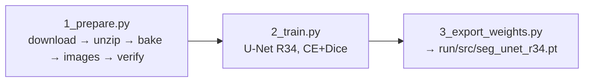
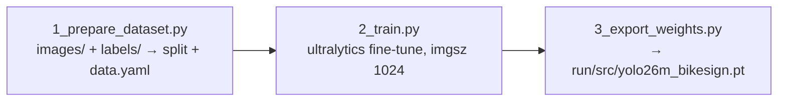

# train/ — how the models were trained

Everything needed to reproduce or replace the two models that `run/` ships:
the lane-marking **segmentation model** (`seg/`, U-Net with a ResNet34
encoder, trained on OpenSatMap) and the bike pavement-symbol **detector**
(`yolo/`, a YOLO fine-tune on labeled MassDOT tiles). Stages 2, 4 and 5 of
the run pipeline (centerlines, join, gaps) have no trainable parameters. Each
script starts with a header (OBJECTIVE / INPUT / OUTPUT / USAGE) — open it or
run it with `--help` for the details not repeated here.

```
train/
├── seg/                          # lane-marking segmentation (stage 1 predict)
│   ├── 1_prepare.py              #   OpenSatMap download → baked masks → 1024 px image/GT tile pairs
│   ├── 2_train.py                #   U-Net (ResNet34), CE + Dice, 30 epochs → best.pt
│   └── 3_export_weights.py       #   best.pt → run/src/seg_unet_r34.pt (+ SHA256SUMS)
├── yolo/                         # bike pavement-symbol detector (stage 3 signs)
│   ├── 1_prepare_dataset.py      #   labeled tiles (YOLO txt) → train/val split + data.yaml
│   ├── 2_train.py                #   ultralytics fine-tune at imgsz 1024 → best.pt
│   └── 3_export_weights.py       #   best.pt → run/src/yolo26m_bikesign.pt (+ SHA256SUMS)
└── export_common.py              # copy-into-run/src + checksum, shared by both 3_export scripts
```

All scripts run from `bicyclist_network/` with the package installed
(`pip install -e ".[all]"`) and read `./bikelane.yaml` if present — for
`data_root` and any `paths:` / `train:` / `yolo:` overrides; no area is
needed. Training data and checkpoints go under `<data_root>/train/`:

```
<data_root>/train/
├── opensatmap/                   raw OpenSatMap download (~50 GB) + tools-release checkout
├── seg/prep_work/                baked masks + image/GT tile pairs
├── seg/ckpts/                    last.pt, best.pt
├── yolo/dataset/                 images/{train,val}, labels/{train,val}, data.yaml
└── yolo/runs/<name>/             ultralytics run: weights/best.pt, results.csv, …
```

(`paths.opensatmap_dir`, `prep_work_dir`, `ckpt_dir`, `yolo_data_dir`,
`yolo_runs_dir` in `bikelane.yaml` move any of these.)

You do not need any of this to run the tool — `python download.py` puts the
released weights into `run/src/`.

<br>

## Segmentation model (`seg/`)

**Data.** [OpenSatMap](https://huggingface.co/datasets/z-hb/OpenSatMap)
level 20 (0.15 m/px — the same GSD as the MassGIS imagery), with its
line-level annotations rendered into 1 px masks by the OpenSatMap
`tools-release` scripts. Classes: 0 background, 1 lane line, 2 curb,
3 virtual line, 255 ignore. Licence CC BY-NC-SA 4.0 — check it fits your
use. The tiles are not in this repository; `1_prepare.py download` fetches
them (~50 GB, resumable).



**The model.** `smp.Unet(resnet34, ImageNet-pretrained encoder, 4 classes)`,
built by `run/bikelane_extract/model/common.py` — the same code `bikelane
predict` uses, so a checkpoint from here loads there unchanged. Ground truth
is 1 px wide, so masks are dilated by 3 px and the loss is cross-entropy
(background weight 0.1) + Dice; flips, 90° rotations and brightness jitter as
augmentation; AdamW 3e-4, cosine schedule, 30 epochs at batch 8, mixed
precision on CUDA. `best.pt` is the epoch with the best mean IoU over the
three line classes. Everything is in the `train:` section of `default.yaml`.

**Running it** (Linux/macOS; `1_prepare.py` uses POSIX shell tools):

```bash
python train/seg/1_prepare.py --check
python train/seg/1_prepare.py download     # (long) Hugging Face + git clone of the tools
python train/seg/1_prepare.py unzip
python train/seg/1_prepare.py bake         # (long) masks + split + 1024 px cut; logs in <prep_work>/bake.log
python train/seg/1_prepare.py images
python train/seg/1_prepare.py verify       # image : GT tile counts must be 1:1

python train/seg/2_train.py --check
python train/seg/2_train.py                # (long) 30 epochs — inside tmux; --resume continues from last.pt
python train/seg/2_train.py --epochs 5     # smoke test

python train/seg/3_export_weights.py       # best.pt → run/src/seg_unet_r34.pt; run/ picks it up as is
```

Per epoch it prints loss and IoU for lane / curb / virtual. The reference
model reached lane IoU ≈ 0.41 — low because the lines are 1–3 px wide, not
because the model misses them. Training needs one CUDA GPU (hours); CPU or
MPS run but take days.

Negative result worth knowing before changing the loss: adding 0.5×clDice
(30 epochs) cut fragmentation 10–17 % but lost 28–31 % coverage — it drops
the faint short segments that residential centerlines are made of. Baseline
kept.

<br>

## Symbol detector (`yolo/`)

**Data.** Bike pavement symbols labeled as boxes on 1024 px MassDOT tiles —
the same tiles the run stages use (`download_MassGIS2025AerialImagery`
output), so they are already 0.15 m/px and 1024 px, which is what `signs
detect` runs at. Three classes, in this order (it is fixed by
`run/bikelane_extract/facility.py`, which the join and gap stages key on):

| id | class | what it is |
|----|-------|------------|
| 0 | `BikeOnly` | bike-lane symbol (bicycle, usually with an arrow) in a dedicated lane |
| 1 | `Sharrow` | shared-lane marking (bicycle with two chevrons) |
| 2 | `OnlyBikeBus` | bike/bus lane marking — detected, but dropped by default at run time (`signs.conf_keep`) |

The labeled tiles used for the released detector are **not part of this
repository**. To label your own: pick tiles from `<imagery_root>/<REGION>/tiles/`
that show symbols (a run of `bikelane signs detect` with the released weights
is a quick way to find candidates), label them in any tool that exports the
YOLO text format (CVAT, Roboflow, Label Studio, labelImg …), and include
tiles without symbols as negatives.



**The model.** A plain ultralytics fine-tune of `yolo.base_model`
(`yolo26m.pt` by default, fetched by ultralytics on first use) at
`imgsz 1024`, 100 epochs, batch 8, early stopping at 30 — the recipe the
released weights came from; augmentation and schedule are ultralytics'
defaults. Parameters are in the `yolo:` section of `default.yaml`.

**Running it:**

```bash
python train/yolo/1_prepare_dataset.py --src /path/to/labeled_tiles     # images/ + labels/ → dataset
python train/yolo/2_train.py --check
python train/yolo/2_train.py [--name bikesign_v2] [--epochs 150]        # (long) inside tmux; --resume
python train/yolo/3_export_weights.py                                   # newest run's best.pt → run/src/
```

What to look at: `results.csv` (mAP50 per class should climb and plateau)
and `val_batch*_pred.jpg` in the run folder (boxes on symbols, not on
manholes or arrows). The acceptance threshold used at run time is a separate,
region-sensitive choice — `bikelane signs filter --sweep` — so training aims
for recall at confidence 0.25, the value `signs detect` runs at.

<br>

## Exporting

Both `3_export_weights.py` scripts copy the checkpoint into `run/src/` under
the name `default.yaml` expects, keep the previous file as
`<name>.<unixtime>.pt`, and refresh `run/src/SHA256SUMS` so that
`python download.py` does not overwrite the new weights later. The YOLO
export checks that the class names inside the checkpoint are exactly
`BikeOnly, Sharrow, OnlyBikeBus`. Nothing in `run/` has to change; the next
`bikelane predict` / `bikelane signs detect` uses the new model.
