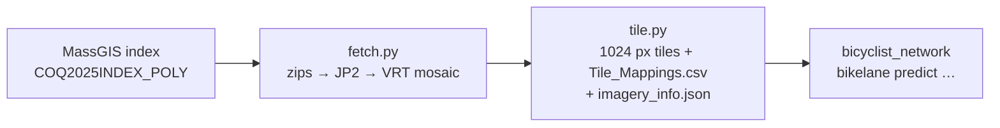

# download_MassGIS2025AerialImagery

Downloads the **MassGIS 2025 statewide orthophotos** (15 cm/px, JPEG2000,
distributed by MassGIS/MassDOT as `COQ2025`) for a town or any polygon, builds
one mosaic, and cuts it into **1024 px JPG tiles with 25 % overlap** plus a
`Tile_Mappings.csv` that ties every tile back to map coordinates. The tiles
are the input of the analysis tools in this repository
(`bicyclist_network/`, …), which read them from `output/<REGION>/`.



```
download_MassGIS2025AerialImagery/
├── fetch.py           # area → index tiles → download + extract → Merged_<REGION>.vrt
├── tile.py            # mosaic → tiles/*.jpg + Tile_Mappings.csv + imagery_info.json
├── common.py          # area / REGION tag / output layout shared by both
├── requirements.txt
└── output/            # created on first run (git-ignored): <REGION>/…
```

## Setup

Python ≥ 3.10 plus the GDAL command-line tools (`gdalbuildvrt`; `gdal_translate`
only for `--build-tif`):

```bash
cd download_MassGIS2025AerialImagery
pip install -r requirements.txt
sudo apt install gdal-bin        # or: conda install -c conda-forge gdal / brew install gdal
python fetch.py --city Lexington --state MA --check      # index / gdal / disk report, nothing downloaded
```

Disk: roughly 0.15 GB of JP2 per index tile (a town ≈ 40–50 tiles ≈ 7 GB; a
whole MPO region is hundreds of GB — `tile.py --cleanup` deletes the sources
once the tiles exist).

## Running it

Give the **same area** to both scripts. Either a town — the name as in the
Census county subdivisions, matched case-insensitively — or any polygon file:

```bash
# one town
python fetch.py --city Lexington --state MA               # (long) run inside tmux
python tile.py  --city Lexington --state MA [--workers 16] [--cleanup]

# any polygon (e.g. a whole MPO region); --name sets the REGION tag
python fetch.py --boundary /path/to/Boundaries.geojson --name boston_mpo
python tile.py  --boundary /path/to/Boundaries.geojson --name boston_mpo --cleanup
```

Both are resumable: existing zips are skipped, and `tile.py` skips every
window already listed in `Tile_Mappings.csv` or `tiles_dropped.txt`. `--check`
on either script reports what exists without doing anything.

`fetch.py` downloads the index shapefile on first use, selects the index
tiles that intersect the town's bounding box (or the boundary polygon itself),
downloads and extracts them, and builds a GDAL VRT over the JP2s. It writes a
single LZW BigTIFF only with `--build-tif` (fine for a town, hundreds of GB
for a region — `tile.py` reads the VRT directly).

`tile.py` reads a 1024 px window every 768 px (25 % overlap), drops windows
that are ≥ 50 % nodata, and writes the rest as `tile_px<X>_py<Y>.jpg`, where
X/Y are the pixel offsets in the mosaic. **Do not lower the nodata threshold
to 0** — that silently drops every tile touching the area boundary. Boundary
runs cut every tile inside the polygon's bounding box; clip the analysis
outputs to the polygon afterwards if needed.

## Output

```
output/
├── massdot_index/COQ2025INDEX_POLY.shp   the index, downloaded once
└── <REGION>/                             LEXINGTON, FALL_RIVER, BOSTON_MPO …
    ├── tiles/tile_px<X>_py<Y>.jpg        1024 px, 0.15 m/px, 25 % overlap      ┐ what the
    ├── Tile_Mappings.csv                 image_name, CRS_X, CRS_Y, Pixel_X, Pixel_Y │ analysis
    ├── imagery_info.json                 crs, resolution_m, tile_px, overlap, …  ┘ reads
    ├── tiles_dropped.txt                 nodata windows (resume bookkeeping)
    ├── Merged_<REGION>.vrt (+ .txt)      the mosaic                 ┐ sources — removed by
    ├── ZipFiles/*.zip                                               │ tile.py --cleanup
    └── Images/*.jp2                                                 ┘
```

`Tile_Mappings.csv` gives, per tile, the mosaic pixel offset (`Pixel_X/Y`,
also in the filename) and the map coordinate of its top-left corner
(`CRS_X/Y`) in the mosaic CRS; `imagery_info.json` names that CRS
(`"crs"`, `"epsg"`) together with the pixel size and tile parameters. Every
analysis stage reconstructs map coordinates from these two files, so keep
them with the tiles.

**REGION tag.** The area name upper-cased with non-alphanumerics replaced by
`_` (`Fall River` → `FALL_RIVER`, `--name boston_mpo` → `BOSTON_MPO`). The
analysis tools derive the same tag from their own project file, so giving
both the same `--city`/`--name` is all it takes for them to find the tiles.
`bicyclist_network/` looks in `../download_MassGIS2025AerialImagery/output/`
by default; another location can be set there with `imagery_root:`.

## Troubleshooting

* **`gdalbuildvrt not on PATH`** — install the GDAL binaries (see Setup);
  the `rasterio` wheel bundles GDAL for reading but not the command-line tools.
* **`town '…' not found`** — the name must match the Census county-subdivision
  name (`Fall River`, not `Fall River city`); check with
  `pygris.county_subdivisions(state="MA", year=2025)["NAME"]`.
* **`worker pool died`** — a JP2 decode ran out of memory; the run continues
  with fewer workers automatically, or restart with `--workers 4`.
* **Different imagery** — anything else (another year, another state) can be
  used by the analysis as long as it ends up as 1024 px tiles named
  `tile_px<X>_py<Y>.jpg` with a `Tile_Mappings.csv` in the same layout;
  point `tile.py` at any mosaic by placing it as `output/<REGION>/Merged_<REGION>.tif`.
