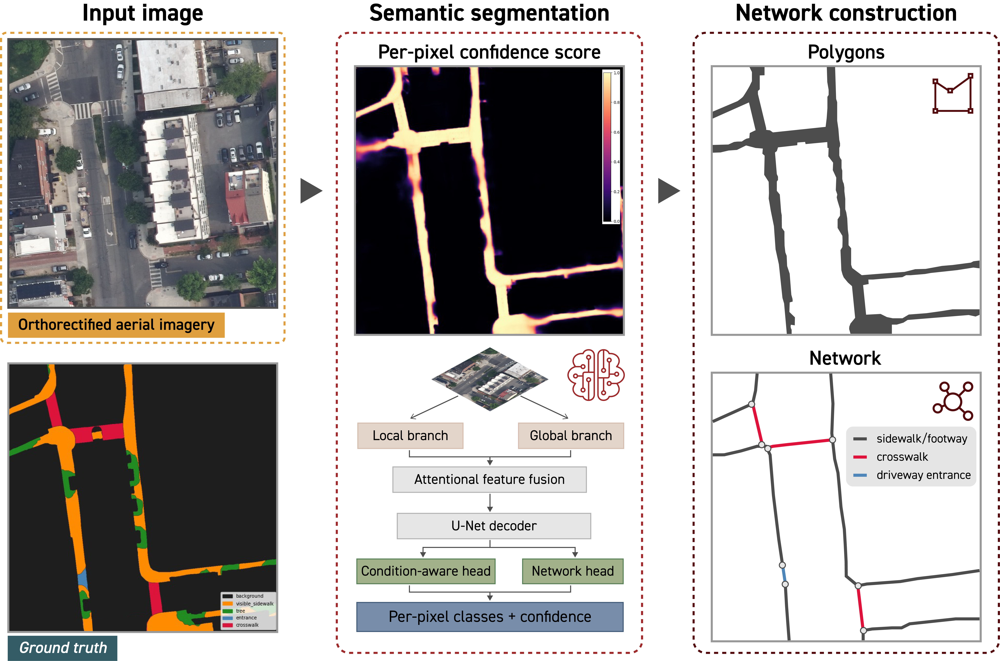

# [TOOL NAME]

<p align="center">
  
</p>

**[Tool Name]** is a tool for automated mapping of pedestrian infrastructure from aerial imagery. A dual-branch Swin Transformer segmentation model detects the components of the pedestrian network (i.e., sidewalks, footway, crosswalks, and midblock driveway entrances) including the portions hidden under tree canopy and shadows. The pixel predictions are converted into geo-referenced polygons with per-pixel confidence scores, and finally into a topologically connected centerline network of links and nodes, ready for pedestrian accessibility, connectivity, and routing analyses.

<br>

**Highlights**

* **Robust to tree occlusion and shadows**: Recovers the network hidden under tree canopy and shadows, so both on-leaf and off-leaf imagery work as input.
* **Beyond sidewalks and crosswalks**: Also detects midblock driveway entrances, an often-ignored component of the pedestrian network.
* **Polygons with confidence scores**: Output polygons preserve geometry (e.g., sidewalk width), and each prediction carries a calibrated per-pixel confidence score for prioritizing where field survey or street view verification is needed.
* **Centerline network construction**: Polygons are skeletonized into centerlines that form the links and nodes of a topologically connected pedestrian network.

<br>

## Updates

* **[September 2026]** Version 0 released (trained on **###** labeled image tiles across **Boston** and **Atlanta**)

## Getting Started

1. [Requirements](#requirements)
2. [Installation](#installation)
3. [Run Our Example](#run-our-example)
4. [Run Your Project](#run-your-project)

### Requirements

**Hardware**

* 1 CUDA-enabled GPU is recommended for inference (≥ 8 GB VRAM).
* The network-construction stage (polygons → centerlines) runs on CPU only.

**Software**

* Python ≥ 3.10
* PyTorch ≥ 2.0 with a CUDA build matching your driver
* Key dependencies (installed automatically): `timm`, `albumentations`, `rasterio`, `scipy`, `scikit-image`, `numpy`, `Pillow`

**Input imagery**

* Orthorectified RGB aerial imagery (recommended at a ground sampling distance of ~0.08 m/px).
* Either on-leaf or off-leaf imagery is supported; see [Run Your Project](#run-your-project) for how to prepare your own tiles.

### Installation

We recommend a fresh virtual environment (conda or venv). Clone the repository:

```bash
git clone https://github.com/<user>/<repo>.git
cd <repo>
```

Create and activate the environment, then install:

```bash
conda create --name pednet python=3.10
conda activate pednet
python -m pip install -r requirements.txt
```

Download the pretrained model weights (Version 0) from **[here](TODO-weights-link)** and place them in:

```
src/weights/
├── best.pt              # model checkpoint
└── temperature.json     # per-head confidence calibration
```

### Run Our Example

The `example/` folder contains a small set of sample tiles and a ready-to-run script, so you can verify your environment, GPU, and the expected outputs before running your own data:

```bash
bash example/run_example.sh
```

This will (1) run segmentation inference on the sample tiles, writing per-pixel class maps and calibrated confidence rasters, and (2) construct the pedestrian network, writing:

```
example/output/
├── confidence/          # per-pixel confidence GeoTIFFs
├── classes/             # 5-class prediction GeoTIFFs
├── network_polygons.geojson   # pedestrian-network polygons
├── skeleton.geojson           # centerline network (links + nodes)
└── network_stats.json         # summary statistics
```

### Run Your Project

**1. Prepare your imagery.** Tile your orthorectified RGB imagery into georeferenced GeoTIFF tiles and place them in a single folder.

**2. Run inference.** This runs the segmentation model tile by tile (sliding-window with blended overlaps) and writes class maps plus temperature-calibrated confidence rasters:

```bash
python src/inference.py --input <path/to/your/tiles> --output <path/to/output>
```

**3. Build the network.** This converts the rasters into the final products — connected network polygons and the skeletonized centerline network:

```bash
python src/build_network.py --input <path/to/output> --thr 0.5
```

Useful parameters to tune for your region: `--thr` (confidence threshold for including a pixel in the network), `--gap-close-px` (closes small gaps between adjacent objects), `--min-spur-m` (prunes short dead-end centerline branches). Run either script with `--help` for the full list.

**Output classes**

| ID | Class | Description |
|----|-------|-------------|
| 0 | background | everything else |
| 1 | sidewalk | sidewalk visible in the imagery |
| 2 | tree over pedestrian infrastructure | tree canopy occluding a sidewalk, crosswalk, or midblock entrance |
| 3 | midblock entrance | driveway entrance crossing the sidewalk visible in the imagery |
| 4 | crosswalk | pedestrian crossing visible in the imagery |

Classes 1–4 together constitute the pedestrian network; the confidence rasters and centerline network are derived from their union.

## Repository Structure

```
.
├── example/     # sample tiles + script to test your setup (see Run Our Example)
├── src/         # everything needed to run the tool: inference, network construction, weights
└── training/    # how the model was trained: labeling protocol, training code, and dataset documentation
```
