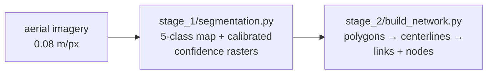

# run/ — apply the tool to your imagery

Two stages turn aerial imagery into a pedestrian network. Every script
starts with a header (OBJECTIVE / INPUT / OUTPUT / HOW IT WORKS / TUNING /
USAGE) — open the script for the details that are not repeated here, or run
it with `--help`.



```
run/
├── src/                      # the trained model — everything stage 1 needs
│   ├── best.pt               #   checkpoint (DBSwinT_v4, ~240 MB; fetched by download.py)
│   ├── temperature.json      #   per-head confidence temperatures
│   ├── train_config.json     #   architecture / input snapshot of the training run
│   ├── model_card.json       #   classes, normalization, confidence formula
│   ├── model.py              #   the architecture (identical copy of train/stage_1/model.py)
│   └── loader.py             #   load_model() → (model, config, temperatures)
├── stage_1/
│   ├── segmentation.py       # imagery → class map + confidence rasters (GPU)
│   └── prepare_image.py      # other formats / resolutions / huge orthos → model-ready tiles
├── stage_2/
│   ├── build_network.py      # rasters → polygons + links + nodes (CPU)
│   ├── crosswalks.py         #   crosswalk clean-up, unique-crossing segmentation, axis correction
│   ├── netgraph.py           #   skeleton → typed links / nodes / polygons
│   ├── skeleton_ops.py       #   skeleton primitives (pruning, tracing, simplification)
│   └── postprocess.py        #   crosswalk snapping, gap closing
└── common.py                 # shared raster / GeoJSON I/O, CRS handling, input inspection
```

<br>

## Setup

One environment covers inference, network construction, image preparation
and training. Install PyTorch **first** (with torchvision, from the index
matching your CUDA driver) so pip does not replace it with a newer CUDA build:

```bash
conda create -n pednet python=3.10 -y && conda activate pednet
pip install torch torchvision --index-url https://download.pytorch.org/whl/cu124
pip install -r requirements.txt
python download.py            # from pedestrian_network/: puts best.pt into run/src/
```

Tested with Python 3.10, PyTorch 2.6 + CUDA 12.4, rasterio 1.4 (GDAL with
JP2OpenJPEG, so JPEG2000 reads without extra software) on an RTX A6000
(~2–3 s per 1024-px tile, ~4 GB VRAM at `--batch 8`).

## Running it

Worked runs on the bundled inputs — model-ready DC tiles and a MassDOT
JPEG2000 ortho that first needs preparing — are in
[`example/README.md`](../example/README.md). For your own imagery, from `run/`:

```bash
python stage_1/segmentation.py --inspect --dir <imagery>                 # 1. report: format, CRS, resolution, READY or NEEDS PREPARE
python stage_1/prepare_image.py --dir <imagery> --out <prepared>        # 2. only if NEEDS PREPARE: RGB, 0.08 m/px, 2048-px tiles
python stage_1/segmentation.py --dir <imagery or prepared> --out <out>  # 3. inspect, load model, segment
python stage_2/build_network.py --input <out>                           # 4. polygons, links, nodes (no GPU)
```

<br>

## Stage 1 — segmentation with calibrated confidence

**Input.** Orthorectified RGB imagery, georeferenced (a GeoTIFF's transform +
CRS is all the location metadata needed), at the model's native 0.08 m/px.
Any image size works; a folder of tiles is inferred seam-free because each
tile is padded with `--context-px` of imagery from its georeferenced
neighbours. Every run first prints an inspection report per input and a
report of the loaded model; `--inspect` stops after the reports, `--force`
runs a `NEEDS PREPARE` input anyway, `--crs EPSG:xxxx` supplies a CRS the
file's tag cannot resolve. Anything else (JPEG2000, RGB+NIR, other
resolutions, one huge ortho) goes through `prepare_image.py` first.

**Output** (`<out>/`):

| File | Content |
|------|---------|
| `classes/<stem>.tif` | uint8 5-class argmax: 0 background, 1 visible_sidewalk, 2 tree (over pedestrian infrastructure), 3 entrance, 4 crosswalk |
| `confidence/<stem>_network.tif` | calibrated probability that the pixel is pedestrian network (classes 1–4) — **the primary confidence score** |
| `confidence/<stem>_crosswalk.tif`, `_entrance.tif` | calibrated crosswalk / midblock-entrance probability |
| `overlay/<stem>.jpg` | imagery blended with class colours — the 5-second sanity check |
| `stage1_summary.json` | per-image class shares, mean confidence, parameters, weights provenance |

Confidence is `p = sigmoid(logit / T_head)` with the temperatures in
`src/temperature.json`. The rasters are uint8 with a band scale of 1/255, so
GDAL/QGIS/rasterio read them as 0–1 (`--confidence-format float32` for raw
values). The 5-class map has no per-class confidence: the model has three
calibrated binary heads plus a hard argmax. Images whose outputs exist are
skipped unless `--overwrite`.

<br>

## Stage 2 — polygons, centerlines, links and nodes

All rasters sharing a CRS and pixel size are mosaicked into one array, so
links connect across tile boundaries. The mosaic is thresholded into a
network mask, crosswalks are cleaned and split into unique crossings, the
mask is skeletonized, and the skeleton becomes a typed graph. The stage runs
on CPU, so it can be re-run alone to tune parameters.

**Output** (`<input>/network/`, or `--out`):

| File | Content |
|------|---------|
| `links.geojson` | LineStrings — `link_id`, `link_type` (sidewalk \| midblock \| crosswalk \| pseudo), `length_m`, `avg_width_m`, `min_width_m`, `from_node`, `to_node` |
| `nodes.geojson` | Points — `node_id`, `node_type` (endpoint \| junction \| type_change), `degree`, `link_types` |
| `network_polygons.geojson` | Polygons — `poly_type` (sidewalk \| midblock \| crosswalk), `area_m2`, `segment_id` (unique crossing id) |
| `*_wgs84.geojson` | the same three layers in WGS84 lon/lat, for web maps |
| `network_mask.tif` | uint8 connected-network mosaic (georeferenced) |
| `network_stats.json` | counts, km by link type, mean widths, parameters used |

The plain GeoJSONs are in the rasters' own CRS (metres) — use them for
lengths, widths and joins with the rasters. Inputs without a usable CRS get
no `_wgs84` files.

**Parameters worth tuning** (defaults assume 0.08 m/px; the full list
with rationale is in the header of `build_network.py`):

| Flag | Default | Meaning |
|------|---------|---------|
| `--thr` | 0.50 | network-confidence threshold for mask inclusion |
| `--min-component-m2` | 100 | drop network components smaller than this |
| `--dangle-max-m` | 8.0 | remove dangling branches shorter than this (unless near a crosswalk, entrance or coverage edge) |
| `--max-pseudo-m` | 4.0 | crosswalk ends join the sidewalk skeleton within this distance |
| `--poly-simplify-m` | 0.30 | Douglas–Peucker tolerance for polygons (0 = raw) |