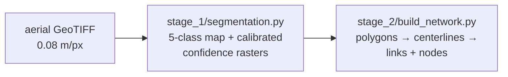

# run/ — apply the tool to your imagery

Two stages turn aerial imagery into a pedestrian network. Stage 1 needs a GPU
(CPU works, slowly); stage 2 is CPU only.



```
run/
├── src/                      # the trained model — everything stage 1 needs
│   ├── best.pt               #   checkpoint (DBSwinT_v4, ~240 MB)
│   ├── temperature.json      #   per-head confidence temperatures
│   ├── train_config.json     #   architecture / input snapshot of the training run
│   ├── model_card.json       #   classes, normalization, confidence formula
│   ├── model.py              #   the architecture (identical copy of train/stage_1/model.py)
│   └── loader.py             #   load_model() → (model, config, temperatures)
├── stage_1/
│   ├── segmentation.py       # image(s) → class map + confidence rasters
│   └── prepare_image.py      # other formats / resolutions / huge orthos → model-ready tiles
├── stage_2/
│   ├── build_network.py      # rasters → polygons + links + nodes (GeoJSON)
│   ├── crosswalks.py         #   crosswalk clean-up, unique-crossing segmentation, axis correction
│   ├── netgraph.py           #   skeleton → typed links / nodes / polygons
│   ├── skeleton_ops.py       #   skeleton primitives (pruning, tracing, simplification)
│   └── postprocess.py        #   crosswalk snapping, gap closing
└── common.py                 # shared raster / GeoJSON I/O, CRS handling, input inspection
```

## Setup

One environment covers everything — inference, network construction, image
preparation and training:

```bash
conda create -n pednet python=3.10 -y && conda activate pednet
pip install torch torchvision --index-url https://download.pytorch.org/whl/cu124   # pick the index matching your CUDA driver
pip install -r requirements.txt
```

Install PyTorch *before* the requirements and together with torchvision, so
pip does not replace it with the newest CUDA build from PyPI. Tested with
Python 3.10, PyTorch 2.6 + CUDA 12.4, timm 1.0, rasterio 1.4 (GDAL 3.10 with
JP2OpenJPEG), shapely 2.1, scipy 1.15, scikit-image 0.25 on an RTX A6000
(a 1024 px tile takes ~2–3 s; VRAM use is ~4 GB at `--batch 8`).

**Weights.** `src/best.pt` must be present. If it is not in your clone, download it into `run/src/`.

## Quick start with the bundled examples

No training needed — `src/` holds the pretrained model (Version 0 trained on DC imagery). From this folder:

```bash
conda activate pednet

# Case A. model-ready tiles (example/input/dc_2023: nine 0.08 m/px GeoTIFFs)
cd run/stage_1
python segmentation.py --inspect --dir ../../example/input/dc_2023           # 1. report only: metadata + READY?
python segmentation.py --dir ../../example/input/dc_2023 --out ../../example/output/dc_2023   # 2. inspect, load model, segment

cd run/stage_2
python build_network.py --input ../../example/output/dc_2023                  # 3. polygons, links, nodes

# Case B. an ortho that needs preparing (example/input/mass_2025: JPEG2000, 4-band, 0.15 m/px)
cd run/stage_1
python segmentation.py --inspect --dir ../../example/input/mass_2025          # -> NEEDS PREPARE
python prepare_image.py --dir ../../example/input/mass_2025 --out ../../example/output/mass_2025/prepared
python segmentation.py --dir ../../example/output/mass_2025/prepared --out ../../example/output/mass_2025 --overlay-px 1024

cd run/stage_2
python build_network.py --input ../../example/output/mass_2025
```

Results land in `example/output/<name>/` (rasters) and
`example/output/<name>/network/` (GeoJSON). Swap the input folder for your
own imagery to run your project; `--dir` takes every raster in a folder.

### Stage 1 — segmentation with calibrated confidence

**What you need as input.** Only imagery — no labels. Each file should be
orthorectified RGB imagery **georeferenced** (a GeoTIFF's affine transform +
CRS is the location metadata; nothing else is required) at **0.08 m/px**, the
model's native resolution. Any image size works: larger images are covered by
a Hann-blended 512-px sliding window, smaller ones are reflect-padded. PNG/JPG
are accepted too, but their outputs carry no georeferencing.

**Inspection first.** Before the model runs, every input is inspected and a
report is printed — format, size, bands, CRS, resolution vs. 0.08 m/px,
coverage in metres and in lat/lon, tiling advice — and a verdict.

```bash
python segmentation.py --inspect --dir ../../example/input/mass_2025
```

Below is an example of MassDOT 2025 imagery:

```
── 19TCG285980.jp2 ─────────────────────────────────────────────
  format      JP2OpenJPEG, 19.4 MB
  size        10000 x 10000 px | 4 band(s) uint8 (first 3 used as RGB)
  georef      yes | CRS EPSG:6348
  extent      1,500 x 1,500 m (225.0 ha) | x 328,500.00..330,000.00, y 4,698,000.00..4,699,500.00
  lat/lon     42.41536..42.42920 N, -71.08483..-71.06616 E
  resolution  0.150 m/px | model native 0.08 m/px -> RESAMPLE x1.875 to 18750 x 18750 px
  tiling      18750 x 18750 px = 352 Mpx as one image (~16 GB RAM in stage 1)
              -> recommend --tile-px 2048 (10 x 10 = 100 tiles)
  status      NEEDS PREPARE: resample from 0.150 to 0.08 m/px; split into 10 x 10 tiles
              -> python run/stage_1/prepare_image.py 19TCG285980.jp2 --tile-px 2048
```

(Had the CRS tag not resolved, the `georef` line would say so and suggest
`--crs EPSG:6348`, guessed from the tag's name.)

Then the model itself is reported (architecture, weights file and source
run, the checkpoint's validation metrics, classes, input contract,
calibration temperatures, device) followed by the run settings:

```
── model ───────────────────────────────────────────────────────
  model       DBSwinT_v4 (dual-branch Swin-T, AFF fusion, U-Net decoder, 4 heads) | 62.9 M parameters
  weights     run/src/best.pt (240 MB) | source run 20260903_110705_v4_unified
  checkpoint  epoch 100, best by validation iou | val network IoU 0.713, F1 0.833 | crosswalk F1 0.915 | entrance F1 0.698
  classes     0 background, 1 visible_sidewalk, 2 tree, 3 entrance, 4 crosswalk | network = classes [1, 2, 3, 4]
  input       RGB uint8 at 0.08 m/px, 512-px windows, ImageNet normalization
  confidence  p = sigmoid(logit / T): T_network 1.802, T_entrance 1.671, T_crosswalk 1.515
  device      cuda (NVIDIA RTX A6000)
── run ─────────────────────────────────────────────────────────
  inputs      9 image(s), 9 georeferenced
  inference   512-px windows, overlap 128 px, context 192 px from neighbouring tiles, batch 8
  outputs     example/output/dc_2023  (classes/, confidence/ [uint8], overlay/, stage1_summary.json)
```

`READY` inputs run as they are. `NEEDS PREPARE` (resolution off by more than
5 %) stops the run and points at `prepare_image.py`; `--force` runs anyway.
`--inspect` prints the reports and exits without loading the model, so you
can check a folder before committing GPU time. With many tiles the first
three get the full report and the rest one line each.

**Preparing other imagery — `prepare_image.py`.** For sources that are not
RGB GeoTIFFs at 0.08 m/px (JPEG2000 orthos, 4-band RGB+NIR, 0.15 m/px, a
single huge ortho, …):

```bash
python prepare_image.py --dir ../../example/input/mass_2025 --out ../../example/output/mass_2025/prepared
```

It keeps the first three bands, resamples to 0.08 m/px (cubic) in the image's
own CRS, assigns `--crs` when the file's tag is unusable, and splits the result
into `--tile-px` tiles (default 2048; `0` keeps one image) named
`<stem>_r<row>_c<col>.tif`. Stage 1 pads each tile with its neighbours, so the
tile size does not affect predictions — it only bounds memory. JPEG2000 is
read by the rasterio wheel installed from `requirements.txt` (its bundled GDAL
has the JP2OpenJPEG driver); a conda-forge rasterio without that driver would
need `libgdal-jp2openjpeg`. Coarser imagery is upsampled so the model
sees the right scale, but the extra detail is not real — expect somewhat
softer predictions than on native 0.08 m/px imagery. The model was trained on
Washington, DC imagery; other regions are out of domain.

*Seam-free tiling.* When you pass a folder of tiles, every tile is inferred on
a canvas padded with `--context-px` (default 192 px ≈ 15 m) of imagery from the
neighbouring tiles — located by their georeferencing, so the tiles can follow
any grid — and cropped back. Edge pixels see the same context as interior
pixels and adjacent tiles agree along their shared edge. `--context-px 0`
restores per-image inference.

*Georeferencing.* Outputs inherit the input's transform and CRS; the
inspection report shows what was read. If the CRS is missing, or cannot be
resolved (some GDAL/PROJ installs read a GIS export's tag as a bare
`LOCAL_CS` without datum or EPSG code), lengths and areas still work but
there is no lat/lon export; pass `--crs EPSG:xxxx` (the report suggests a
code when the tag's name allows it). Files named `tile_<TX>_<TY>.tif` that
sit on the DC grid are tagged EPSG:26985 automatically.

**Output** (`<out>/`):

| File | Content |
|------|---------|
| `classes/<stem>.tif` | uint8 5-class argmax: 0 background, 1 visible_sidewalk, 2 tree (over pedestrian infrastructure), 3 entrance, 4 crosswalk |
| `confidence/<stem>_network.tif` | calibrated probability that the pixel is pedestrian network (classes 1–4) — **the primary confidence score** |
| `confidence/<stem>_crosswalk.tif` | calibrated crosswalk probability |
| `confidence/<stem>_entrance.tif` | calibrated midblock-entrance probability |
| `overlay/<stem>.jpg` | image blended with class colours — the 5-second sanity check |
| `stage1_summary.json` | per-image class shares, mean confidence, parameters, weights provenance |

Confidence is `p = sigmoid(logit / T_head)` with the per-head temperature from
`src/temperature.json`, i.e. a calibrated probability rather than a raw score.
By default the confidence rasters are stored as **uint8 with a band scale of
1/255** (GDAL reads them back as 0–1 automatically; ~0.4 % steps, ~10× smaller
files); `--confidence-format float32` stores the raw probabilities. There is
no per-class confidence for the 5-class map: the model has three calibrated
binary heads (network, crosswalk, entrance) plus a hard 5-class argmax.

Stage 1 is resumable: images whose four rasters already exist are skipped
unless `--overwrite`.

### Stage 2 — polygons, centerlines, links and nodes

```bash
cd run/stage_2
python build_network.py --input /path/to/out                 # reads <out>/classes + <out>/confidence
python build_network.py --input /path/to/out --thr 0.4       # re-tune (no GPU needed)
```

All rasters that share a CRS and pixel size are mosaicked into **one** array
before anything is skeletonized, so links connect naturally across tile
boundaries. Then, in order:

1. **Crosswalk clean-up** per chunk: close/open, hole fill, speck reassignment,
   rectangle regularization; seam sealing between crosswalk and walkable
   surface; snapping of crosswalk components to the nearest walkable pixel
   within `--max-snap-px` (stranded ones farther away are dropped).
2. **Network mask** = `(network confidence ≥ --thr) OR classes 1–4`, gap-closed
   (`--gap-close-px`), enclosed holes < `--max-hole-m2` filled, components
   < `--min-component-m2` dropped.
3. **Sidewalk skeleton** from the mask with crosswalk removed. **Crosswalk
   regions** from the raw class map are kept only within `--buffer-m` of a
   sidewalk centerline and split into **unique crossings** (adaptive erosion +
   watershed with forced 2-px separation); each crossing's axis is corrected
   from its own road edges; midblock components touching a crosswalk are
   erased as false positives; dangling branches ≤ `--dangle-max-m` are removed
   unless their free end is near a crosswalk, a midblock entrance, or the edge
   of the covered area (cut by data extent, not error).
4. **Typed graph.** Crosswalk axes and ≤ `--max-pseudo-m` pseudo connectors
   join the sidewalk skeleton; links are split at type changes, merged through
   pass-through nodes, gently straightened (Gaussian + straightness-adaptive
   Douglas–Peucker) and split at midblock entrances. Nodes are typed
   endpoint / junction / type_change. Polygons are typed from the class map
   (one polygon per unique crosswalk), smoothed and simplified.

**Output** (`<input>/network/`, or `--out`):

| File | Content |
|------|---------|
| `links.geojson` | LineStrings — `link_id`, `link_type` (sidewalk \| midblock \| crosswalk \| pseudo), `length_m`, `avg_width_m`, `min_width_m`, `from_node`, `to_node` |
| `nodes.geojson` | Points — `node_id`, `node_type` (endpoint \| junction \| type_change), `degree`, `link_types` |
| `network_polygons.geojson` | Polygons — `poly_type` (sidewalk \| midblock \| crosswalk), `area_m2`, `segment_id` (unique crossing id) |
| `*_wgs84.geojson` | the same three layers in **WGS84 lon/lat** (RFC 7946) — for web maps (kepler.gl, geojson.io, Leaflet) |
| `network_mask.tif` | uint8 connected-network mosaic (georeferenced) |
| `network_stats.json` | counts, km by link type, mean widths, parameters used |

The plain GeoJSONs are in the rasters' own CRS (metres for the DC example,
EPSG:26985) — use them for lengths, widths and joins with the rasters. Inputs
that lack a usable CRS get no `_wgs84` files (pass `--crs`).

**Parameters worth knowing** (defaults assume 0.08 m/px):

| Flag | Default | Meaning |
|------|---------|---------|
| `--thr` | 0.50 | network-confidence threshold for mask inclusion |
| `--gap-close-px` | 2 | residual gap closing radius after mosaicking |
| `--max-hole-m2` | 5.0 | enclosed mask holes smaller than this are filled (bigger = real medians, kept) |
| `--min-component-m2` | 100.0 | drop network components smaller than this |
| `--max-snap-px` | 25 | crosswalk snap distance (25 px = 2 m) |
| `--buffer-m` | 5.0 | crosswalk regions farther than this from a sidewalk centerline are dropped |
| `--min-spur-m` | 3.0 | prune skeleton dead-ends shorter than this |
| `--dangle-max-m` | 8.0 | dangling sidewalk branch shorter than this is removed (unless near crosswalk / midblock / coverage edge) |
| `--max-pseudo-m` | 4.0 | crosswalk ends join the sidewalk skeleton within this distance |
| `--poly-smooth-m` / `--poly-simplify-m` | 0.20 / 0.30 | buffer smoothing + Douglas–Peucker for polygons (0 = raw) |
| `--chunk-px` | 1024 | chunk size for the per-chunk crosswalk clean-up |

Stage 2 needs no GPU, so every knob can be re-tuned by re-running
`build_network.py` alone. Memory scales with the mosaic extent (a 3×3 block of
1024-px tiles takes seconds; a full city should be run in blocks).
