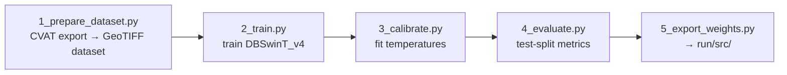

# train/ — how the model was trained

Everything needed to reproduce (or extend) the segmentation model that `run/`
ships: the training code (`stage_1/`) and the finalized labeled dataset
(`v0_2026sep_image/`). The network-construction stage (`run/stage_2/`) does not requeire training.

```
train/
├── stage_1/                 # semantic-segmentation training pipeline (steps 1–5)
├── v0_2026sep_image/        # finalized training data: DC 2023 + 2025 tiles
│   ├── dc_2023/             # 514 tiles
│   ├── dc_2025/             # 504 tiles
│   │   ├── images/tile_<TX>_<TY>.tif   RGB aerial GeoTIFF, 1024×1024 px, 0.08 m/px   ┐ NOT in git: fetched from the
│   │   ├── masks/tile_<TX>_<TY>.tif    uint8 class-index GeoTIFF, ONE band, values 0–4 ┘ release by `python download.py --dataset`
│   │   ├── splits.json                 fixed train/val/test split (8:1:1, seed 42)
│   │   └── dataset_stats.json          per-year pixel statistics
│   └── combined_dataset_stats.json     combined class weights read by 2_train.py
└── output/                  # created by training: runs/<name>_<timestamp>/ (git-ignored)
```

## The dataset (`v0_2026sep_image/`)

High-resolution (0.08 m/px, ≈ 3 in) orthorectified aerial imagery of
Washington, DC, labeled in CVAT and exported as a single class-index mask per
tile. Two acquisition dates cover the same tile grid — 2023 (leaf-on) and 2025 (leaf-off) — so the model
sees both conditions for the same streets. Each mask is a **single** raster
whose pixel value is the class index:

| ID | Class | Labeling rule |
|----|-------|---------------|
| 0 | background | everything else (implicit) |
| 1 | visible_sidewalk | walkable pedestrian surface directly visible in the imagery |
| 2 | tree | tree canopy **only where it occludes pedestrian infrastructure** (the inferred extent of the surface beneath) |
| 3 | entrance | midblock driveway entrance crossing the sidewalk |
| 4 | crosswalk | marked pedestrian crossing |

Classes 1–4 together are the pedestrian network.

**Tile grid.** Tiles are named `tile_<TX>_<TY>` on a fixed grid; the stem alone
determines the georeferencing (also embedded in each GeoTIFF):

```
EPSG      = 26985            # NAD83 / Maryland (m)
RES       = 0.08 m/px
TILE_PX   = 1024             # 81.92 m on a side
GRID_XMIN = 395852.57        # x of tile_0_0's left edge
GRID_YMAX = 140914.34        # y of tile_0_0's top edge
xmin = GRID_XMIN + TX * 81.92 ;  ymax = GRID_YMAX - TY * 81.92
```

The same constants live in `stage_1/config.py` and `run/common.py` (as the
fallback for DC tiles whose embedded CRS tag has no EPSG code) — keep them in
sync. A new region gets its own grid defined the same way.

**Splits.** Keep `splits.json` untouched: it preserves the exact train/val/test
membership used for the released weights, so metrics stay comparable across
model versions. 2023 has 514 of 515 source tiles (one tile has no mask in the
CVAT export and is dropped from the split; expected).

**Getting the data.** The tiles (≈ 2.4 GB) are not in git — only
`splits.json`, the stats files and this README are. They are attached to the
GitHub Release `pednet-v0.1` as `dc_2023.zip` and `dc_2025.zip`; from the
`pedestrian_network/` folder:

```bash
python download.py --dataset    # -> dc_2023/{images,masks}, dc_2025/{images,masks}
```

(or unzip the two archives by hand into this folder). If you only want to
run the model you do not need this data at all — `run/src/` is self-contained.

## The training pipeline (`stage_1/`)

Trains **DBSwinT_v4**, a dual-branch Swin Transformer that segments the
pedestrian network (visible sidewalk, tree-occluded infrastructure, midblock
entrance, crosswalk) and outputs calibrated per-pixel confidence.



Numbered scripts are the **steps you run, in order**; unnumbered modules are the
shared library they import. `main.py` chains the five steps.

| File | Role |
|------|------|
| `main.py` | run steps 1→5 end to end (`python main.py --steps 2,3,4,5`; forward training args after `--`) |
| `1_prepare_dataset.py` | CVAT "Segmentation mask 1.1" export → class-index GeoTIFFs, preserved splits, class weights; `--qa` adds gap + crosswalk label checks. Only needed to **rebuild or extend** the data (its raw inputs are not in the repo, see below) |
| `2_train.py` | train DBSwinT_v4; auto-calibrates at the end |
| `3_calibrate.py` | re-fit per-head confidence temperatures on the val split (only if training was interrupted or the split changed) |
| `4_evaluate.py` | held-out metrics (network IoU/F1, per-class recalls, aux-head metrics) → `<run>/test_metrics.json` |
| `5_export_weights.py` | copy the deployable artifacts (`best.pt`, `temperature.json`, `train_config.json`, model card) → `run/src/` |
| `config.py` | **single place for all paths, classes, and hyperparameters** |
| `dataset.py` | `SidewalkDataset`, augmentations, split loading |
| `model.py` | DBSwinT_v4 architecture (`run/src/model.py` is an identical copy) |
| `losses.py` | gap-tolerant targets, CE + Dice + RMI + connectivity losses, metrics |
| `engine.py` | train / validate loops |
| `calibration.py` | LBFGS temperature fitting |
| `utils.py` | run folders, logging, optimizer parameter groups |

### Key design points

* **Dual-branch backbone.** A *local* Swin-T branch (patch 4, ImageNet-pretrained
  via `timm`) resolves fine detail — curb edges, crosswalk markings — while a
  *global* branch (patch 8, trained from scratch) captures the long-range
  continuity needed to infer the network under tree canopy and shadow. The
  branches are fused at every encoder stage with Attentional Feature Fusion
  (MS-CAM), then decoded by a U-Net decoder with skip connections.
* **Four heads.** A condition-aware 5-class head (visible vs. occluded), a
  binary *network* head supervising the full walkable union (classes 1–4) — the
  source of the primary confidence output — and auxiliary entrance / crosswalk
  heads that sharpen the two rarest classes.
* **Gap-tolerant supervision.** CVAT polygons leave ~2–3 px background slivers
  between adjacent objects. Targets are built on the GPU per batch: the network
  target is morphologically closed (`GAP_CLOSE_PX = 2`) so the model learns a
  *connected* network, and the filled gap band is CE-ignored (index 255) so the
  5-class head is not forced to reproduce the slivers.
* **Crosswalk connectivity loss.** Crosswalk probability mass predicted farther
  than `CONN_RADIUS_PX = 8` px (0.64 m) from predicted walkable surface is
  penalized (λ = 0.20), suppressing stranded mid-roadway false positives.
* **Losses / optimization.** Weighted CE (inverse-frequency, clipped at 25) +
  Dice + RMI per head; AdamW with two LR groups (2e-4 scratch / 2e-5 pretrained
  branch); 5-epoch warmup + cosine decay over 120 epochs; best checkpoint by
  validation **network IoU**; 512-px random crops with flips / rotations /
  color jitter (+ optional stronger augmentation).
* **Calibrated confidence.** After training, one temperature per binary head is
  fitted on the val split (LBFGS) → `temperature.json`. Downstream confidence
  is `p = sigmoid(logit / T)` — a calibrated probability, not a raw score. The
  5-class head is used as a hard argmax and carries no per-class confidence.

### Running it

```bash
conda activate pednet                 # the same env as run/ (see run/README.md → Setup)
python download.py --dataset          # once, from pedestrian_network/: fetch images/ + masks/ (~2.4 GB) from the release
cd train/stage_1

python 2_train.py --name v4_unified   # long (~120 epochs); run inside tmux; resumable with --resume <run_dir>
python 4_evaluate.py                  # test metrics for the newest run
python 5_export_weights.py            # deployable weights -> run/src/
```

or `python main.py --steps 2,3,4,5`. Every hyperparameter has a CLI flag
(`python 2_train.py --help`); defaults live in `config.py`. Training needs one
CUDA GPU (batch 4 × 512 px fits comfortably in 16 GB). The pretrained Swin-T
weights for the local branch are downloaded by `timm` on first use.

Outputs:

```
train/output/runs/<name>_<timestamp>/   best.pt, last.pt, config.json, history.json,
                                        train.log, temperature.json, test_metrics.json
run/src/                                best.pt, temperature.json, train_config.json,
                                        model_card.json                ← what run/ uses
```

### Rebuilding the dataset from a new CVAT export (step 1)

`1_prepare_dataset.py` converts a CVAT "Segmentation mask 1.1" export into the
layout above. It expects the raw inputs under `v0_2026sep_image/`, which are
**not** shipped in the repo:

```
v0_2026sep_image/cvat_exports/DC_<year>.zip       # SegmentationClass/*.png + labelmap.txt
                                                  #   (color→class is read from labelmap.txt by NAME)
v0_2026sep_image/imagery/dc_<year>/images/        # source aerial GeoTIFF tiles
v0_2026sep_image/imagery/dc_<year>/splits.json    # split to preserve (else fresh 8:1:1, seed 42)
```

Then `python 1_prepare_dataset.py --qa`. The year → export-name mapping is
`CVAT_EXPORTS` in `config.py`.
