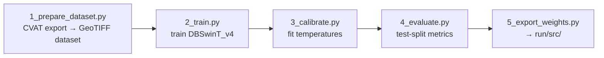

# train/ — how the model was trained

Everything needed to reproduce or extend the segmentation model that `run/`
ships: the training code (`stage_1/`) and the labeled dataset
(`v0_2026sep_image/`). The network-construction stage (`run/stage_2/`) has no
trainable parameters. Each numbered script starts with a header (OBJECTIVE /
INPUT / OUTPUT / HOW IT WORKS / TUNING / USAGE) — open the script or run it
with `--help` for the details not repeated here.

```
train/
├── stage_1/                 # semantic-segmentation training pipeline (steps 1–5)
├── v0_2026sep_image/        # training data: DC 2023 (514 tiles) + 2025 (504 tiles)
│   ├── dc_2023/, dc_2025/
│   │   ├── images/tile_<TX>_<TY>.tif   RGB aerial GeoTIFF, 1024×1024 px, 0.08 m/px   ┐ NOT in git: fetched from the
│   │   ├── masks/tile_<TX>_<TY>.tif    uint8 class-index GeoTIFF, one band, values 0–4 ┘ release by `python download.py --dataset`
│   │   ├── splits.json                 fixed train/val/test split (8:1:1, seed 42)
│   │   └── dataset_stats.json          per-year pixel statistics
│   └── combined_dataset_stats.json     combined class weights read by 2_train.py
└── output/                  # created by training: runs/<name>_<timestamp>/ (git-ignored)
```

## The dataset (`v0_2026sep_image/`)

Orthorectified aerial imagery of Washington, DC at 0.08 m/px, labeled in
CVAT, on the same tile grid for two dates — 2023 leaf-on and 2025 leaf-off —
so the model sees both conditions for the same streets. Each mask is one
raster whose pixel value is the class index:

| ID | Class | Labeling rule |
|----|-------|---------------|
| 0 | background | everything else (implicit) |
| 1 | visible_sidewalk | walkable pedestrian surface directly visible in the imagery |
| 2 | tree | tree canopy **only where it occludes pedestrian infrastructure** (the inferred extent of the surface beneath) |
| 3 | entrance | midblock driveway entrance crossing the sidewalk |
| 4 | crosswalk | marked pedestrian crossing |

Classes 1–4 together are the pedestrian network. Tiles are named
`tile_<TX>_<TY>` on a fixed grid (EPSG:26985, 81.92 m per tile; the constants
are in `stage_1/config.py` and mirrored in `run/common.py`). Keep
`splits.json` untouched so metrics stay comparable across model versions.

**Getting the data.** The tiles (≈ 2.4 GB) are attached to the GitHub Release
`pednet-v0.1` as `dc_2023.zip` and `dc_2025.zip`. From `pedestrian_network/`:

```bash
python download.py --dataset    # -> dc_2023/{images,masks}, dc_2025/{images,masks}
```

You do not need this data to run the model — `run/src/` is self-contained.

## The training pipeline (`stage_1/`)



| File | Role |
|------|------|
| `1_prepare_dataset.py` | CVAT "Segmentation mask 1.1" export → class-index GeoTIFFs + splits + class weights. Only for rebuilding or extending the data; its raw inputs are not in the repo (see its header) |
| `2_train.py` | train DBSwinT_v4; calibrates at the end |
| `3_calibrate.py` | re-fit the per-head confidence temperatures (only if training was interrupted or the split changed) |
| `4_evaluate.py` | held-out metrics → `<run>/test_metrics.json` |
| `5_export_weights.py` | copy `best.pt`, `temperature.json`, `train_config.json`, model card → `run/src/` |
| `main.py` | chain the steps (`python main.py --steps 2,3,4,5`) |
| `config.py` | all paths, classes and hyperparameters in one place |
| `dataset.py`, `model.py`, `losses.py`, `engine.py`, `calibration.py`, `utils.py` | shared library the steps import |

**The model in brief.** DBSwinT_v4 is a dual-branch Swin-T: an
ImageNet-pretrained local branch for fine detail plus a global branch for the
long-range continuity needed under tree canopy and shadow, fused per stage
(AFF) and decoded by a U-Net decoder. Four heads: a 5-class map, a binary
network head over classes 1–4 (the primary confidence), and auxiliary
entrance and crosswalk heads. Targets are gap-tolerant (CVAT slivers between
adjacent polygons are closed and CE-ignored), a connectivity loss suppresses
stranded crosswalk predictions, and after training one temperature per
binary head is fitted on the val split so confidence is
`p = sigmoid(logit / T)`. Losses, schedule and augmentation are documented in
the header of `2_train.py` and set in `config.py`.

### Running it

```bash
conda activate pednet                 # the same env as run/ (see run/README.md → Setup)
python download.py --dataset          # once, from pedestrian_network/
cd train/stage_1

python 2_train.py --name v4_unified   # ~120 epochs; run inside tmux; resumable with --resume <run_dir>
python 4_evaluate.py                  # test metrics for the newest run
python 5_export_weights.py            # deployable weights -> run/src/, picked up by run/ as is
```

Training needs one CUDA GPU (batch 4 × 512 px fits in 16 GB); `timm`
downloads the pretrained Swin-T weights on first use. Outputs:

```
train/output/runs/<name>_<timestamp>/   best.pt, last.pt, config.json, history.json,
                                        train.log, temperature.json, test_metrics.json
run/src/                                best.pt, temperature.json, train_config.json, model_card.json
```
